# Git

This workshop introduces the Git source control tool to new users
at Los Angeles County.  Because there are many excellent freely available
Git references, there is little point attempting another one from
scratch. Rather, this is intended as a guide through the available
references along with descriptions of how we apply these concepts
for certain Git repositories managed by ISAB.

It's important to become comfortable with the references.
You should bookmark the ones you find useful and refer to them first
when you have questions.  Then, if necessary, seek help from others for
clarity on the documentation rather than as a substitute for the
documentation.

For Git, a great place to start for information is

<https://git-scm.com/doc>

In particular, the book [Pro Git](https://git-scm.com/book/en/v2)
is freely available to download or browse on the web.  Updated
[command references](https://git-scm.com/docs)
are also available there.

This document is an outline used to guide a pair of workshops.

**Week 1**

* [Installation](#installation)
* [Initialization](#initialization)
* [Basic Lifecycle](#basic-lifecycle)
* [Log and Diff](#log-and-diff)
* [Branches](#branches)

**Week 2**

* [Merge Conflicts](#merge-conflicts)
* [Remotes](#remotes)

## Installation

Most county employees will be running Git on a Windows workstation.
The Git installer for Windows is available for free download from

<https://git-scm.com/download/win>

Running the installer is mostly straight forward.  Below are some tips
for helping you through the installation wizard.

* The default installation location is usually fine.

* Under **Select Components**, I deselect `Git Bash Here` and
  deselect `Associate .sh files to be run with Bash`.  You should
  be able to do all your Git work from your DOS command line.

  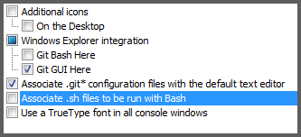

* Under **Adjusting your PATH environment**, select the middle
  option for `Use Git from the Windows Command Prompt`.

* Under **Choosing HTTPS Transport Backend**, I choose `OpenSSL`.
  The native Windows Secure Channel library is a newer option.
  Feel free to experiment if you wish.  But the only remote Git
  server we're likely to use with HTTPS is GitHub.  The
  `ca-bundle.crt` file should be sufficient for that.

* The **Configurating line ending conversions** can be a tricky
  decision.  For most cases, the first option is appropriate.
  A common problem with source controlling text files
  is that one user with a Linux or OS X workstation will check in
  a file with LF endings.  Then a Windows user will check out the
  file, change a single line, and commit the change.  But the
  diff-tools will show that the Windows developer changed every
  line in the file.  What happened is that the Windows editor
  changed every LF occurrence to CR-LF.  This is not a Git-specific
  issue, but Git attempts to address it on Windows by converting
  back and forth between LF (Unix and OS X convention) and CR-LF
  Windows convention.

  If you run an editor that automatically converts LF to CR-LF,
  then please select the first option to protect the rest of us
  from your unintended line changes.  If, on the other hand, you
  maintain Linux/Unix shell scripts as part of your job, **and**
  you FTP them in binary mode to the server (i.e. as part of zip
  archive), **and** you use an editor that does not corrupt
  end-of-line characters, then select the middle option.  If none
  of this makes sense to you, select the first option.

* For terminal emulate, choose `Use Windows default console window`.
  The other one may be OK, too, if you wish to experiment.

* For **extra options**, leave the defaults.

After installation, check that the `C:\Program Files\Git\cmd`
directory is in your `PATH` variable.  You can add it manually
through the following steps:

1. Open Control Panel.
2. Choose the **System** section.
3. Choose **Advanced system settings**.
4. Choose the **Advanced** tab.
5. Click the **Environment Variables** button.
6. Under **User variables** select `PATH` and click **Edit**.
7. Add the path to the entry.  The separator is a `;`.
8. Click **OK** to dismiss the windows and close Control Panel.
9. Exit and restart the command window.

You can check your work with

```
echo %PATH%
```

to see that your PATH variable was changed.

Another fun directory to add to your `PATH` is `Git\usr\bin`.
That gives you some Unix utilities and an **ssh** client.

### First Time Setup

First time setup is described well in the
[Pro Git book](https://git-scm.com/book/en/v2)
under the section
[Getting Started - First-Time Git Setup](https://git-scm.com/book/en/v2/Getting-Started-First-Time-Git-Setup)
The most important section is setting your `user.name`
and `user.email` properties.

```
> git config --global user.name "John Doe"
> git config --global user.email jdoe@somewhere.gov
```

The `--global` flag set the property in your global user
configuration file.

By default, Git on Windows uses its own version of **vi** to
edit commit comments.  If this doesn't sit well with you, then
you might want to change it to something else.  Note that your
choice needs to work with Git, like `vi`, `emacs`,
or `Notepad++`.  Editors that do **not** work with Git are
`notepad` and `write`.  It's also possible to provide a one-line
commit message on the command line.

### GUI Git

There are a number of
[Git GUI programs](https://git-scm.com/downloads/guis)
available.  Some of
them are standalone; others are part of IDEs (Integrated
Development Environments) like Eclipse (Java), Visual Studio
(.Net), RStudio (R), and others.
The GUIs are mostly good.  But you are strongly encouraged
to understand the Git command line.

1. Most actions of any GUI tool can be understood in terms
   of the command line.  
2. The definitive Git documentation expresses Git operation
   in terms of Git commands and command line options.
3. You may have to change between various GUI tools; but
   the command line stays the same.
4. When searching for help in public forums (such as
   <https://stackoverflow.com>), questions and answers are
   most easily expressed in terms of the command line.

Once you are well grounded in the command line, most GUI Git
tools are easy to understand.


## Initialization

There are two ways to create a Git repository:

1. *Init* a new repository to track files on your workstation
   that are not currently under source control.
2. *Clone* an existing repository from somewhere else to your
   workstation.

### init

The Git `init` command creates a new repository.  It's normally used
to create a new local repository for files you wish to place under
source control.  To run this command, first change to the directory
that will be the root of the repository.  Then run the command.

```
git init
```

It will be very anticlimactic.  All it does is create a `.git`
folder in your directory.  Because the name starts with a dot,
your file explorer may not even show it.  The `.git` folder
contains an **empty** Git repository.  It's important to understand
that none of the code that may have existed in the folder when
you issued the `git init` command is part of the repository yet.
This is by design.  After all, you may not want every file in
your directory to be part of the repository.

To track the code your directory, you first must add it to the
Git staging area.  This is done with the `git add` command.  The
parameters to this command specify which files you want to add.
You can specify file names, directory names, or both.  When a
directory is specified, all its files are added and all its
subdirectories are added recursively.  The following command
adds everything.

```
git add .
```

Now all the files are in the staging area and ready to commit.

```
git commit -m "Initial version"
```

This command will commit the change using the message
`Initial version`.  This avoids a `vi` session for those of you
not familiar withe the `vi` editor.  But it limits you to
commit messages that are a single line.

### clone

The **clone** command clones a repository from one location to
another location.  It's commonly used to obtain a local copy of
a Git repository hosted remotely.  For example:

```
git clone https://github.com/lacounty-isab/workshops workshops
```

will copy the `workshops` repository on GitHub into a new subdirectory
of your current directory named `workshops`.  You could make another
copy like this.

```
git clone workshops wksp2
```

This does the same thing; except doesn't use the network.

### Working Copy

A typical directory containing a Git repository might look like the
the following.

```
-- MyRepo/
   |-- .git/
   |-- src/
   |-- docs/
   |-- readme.md
```

In such a configuration, the `.git` folder is the repository proper.
The other files are collectively known as *the working copy*.  It's
tempting to identify the working copy with the repository.  This is
often harmless; but we should keep in mind that the working copy is
just that, a **copy**.  Every version of every file in a repository
is stored in the `.git` folder in some way.  The
working copy is for the convenience of the developer.


## Basic Lifecycle

Most of us have worked with some sort of *centralized* version control
system (CVCS) in the past.  Tools such as **CVS**, **SVN**, and
**ClearCase** have a basic lifecycle of

1. checkout - copy a version to local workspace
2. edit - edit working copy
3. commit - write changes back to server
4. repeat

The server contains the history of every file.  Our workstation contains
a working copy that we can edit.  But anything related to other versions
of files in terms of

* comparing them
* reading their commit comments
* creating branches
* conflict resolution

requires a connection to the server.  This is inefficient even when we
do have good network connectivity.  Git is an example of a
[distributed](https://git-scm.com/about/distributed)
version control system (DVCS).  Every copy of the repository is the full
version history.  There may be an instance that a team calls "the server."
But that's purely by convention.

There is no such thing as a "Git client" that is distinct from a Git
server.  All *checkout* and *commit* commands work on local repositories.
There are commands that push and pull changes between two repositories.
But these changes have to have been committed locally first.  There is
no notion of using a Git client to browse a server.  Rather, you clone
the server repository to a local repository on your workstation and browse
it using your workstation file manager.

Once you have a local copy of the repository the basic lifecycle goes
like this.

1. checkout - change to a branch; often create a new one.
2. edit - edit working copy.
3. stage - add the changes to a staging area.
4. commit - commit changes.
5. repeat steps 2 - 4.
6. push commits to a server copy of the repository.

Note that in the case of a local-only repository, step 6 never happens.
The commands used in the basic lifecycle are discussed in more detail below.
Reference is often made to **HEAD**.  This is a pointer that refers to
the place in the commit tree where the next commit will be applied.

### git checkout

The `git checkout` command has two modes.  If the argument is the name
of a branch, then the HEAD pointer is moved to that branch and your
working copy files are replaced with the branch's latest version.
If the argument is a working copy file name, it means replace the existing
working copy with the committed copy associated with the HEAD commit.

```
git checkout i40
```

will make `i40` the current branch (i.e. point HEAD to `i40`) and replace
the working copy files with the version associated with `i40`.

```
git checkout i40 -- readme.md
```

will replace the current version of `readme.md` in the working copy
with the version associated with the `i40` branch.  But it will not
switch HEAD to that branch.  If the `readme.md` has local edits that have
not been saved (via a commit), you will receive a warning.  Use the
force `-f` option to override.  The `--` is used to separate the branch
name from the file name (multiple file names are allowed).
This is not as common as the first form used to switch to another branch.  

It's common to create a new branch before starting work.

```
git branch MyNewBranch
git checkout MyNewBranch
```

The first command creates a new branch, but it does not change HEAD to
it.  The second command changes HEAD.  A single-command short-cut equivalent
to the above two commands is

```
git checkout -b MyNewBranch
```

This creates a new branch and switches HEAD to it.

With all this branch creation and switching, it's good to know where
you stand with respect to the current branch.  The `git branch` command
with no arguments lists all your local branches and highlights the current
branch with an asterisk.

```
$ git branch
  i35
  i40
  i45
  i47
  i48
  lasd/gards
  lasd/juvwrnt
* master
```

In the example above, there are eight local branches.  HEAD is currently
pointing to the `master` branch.  Another command used to determine your
status is the `git status` command.

```
$ git status
On branch master
Changes not staged for commit:
  (use "git add <file>..." to update what will be committed)
  (use "git checkout -- <file>..." to discard changes in working directory)

	modified:   Tables/DM_event_xref.tbl

no changes added to commit (use "git add" and/or "git commit -a")
```

The first line of the response says `master` is the current branch.  Next
it lists a file that has changed, but been staged.  It also reminds us of

1. the command to stage the file
2. the command to discard the changes.

The last line of the output says we have no staged changes.

### git add

During our edit session several files may have changed.  Some changes we
want to keep; other changes not.  Some temporary files may have been
created that we want to keep locally, but not track in source control.
The Git **add** command is how we cherry-pick exactly what we want to commit
and exclude what we don't.  The `git add` command adds **changes** to the
[staging area](https://git-scm.com/about/staging-area).
Wake up, because this is subtle.  It does **not** place *the file*
in the staging area.  It copies the contents of the file into the staging area.
If you make another change to the file and run `commit`, you commit what you
added earlier, not new changes to the file.  You have to run `git add` again
to commit the new changes.

Here is an example.

```
isabmbp1:~/idsc/workshops/git$ git add readme.md
isabmbp1:~/idsc/workshops/git$ git status
On branch git
Changes to be committed:
  (use "git reset HEAD <file>..." to unstage)

	modified:   readme.md

Untracked files:
  (use "git add <file>..." to include in what will be committed)

	../distributions/
```

I added changes to the very file you're reading and then ran `git status`.
It says that `readme.md` is ready to be committed (it's been staged).  
But now I'm typing more stuff into it before I commit.  Let's run
`git status` again.

```
isabmbp1:~/idsc/workshops/git$ git status
On branch git
Changes to be committed:
  (use "git reset HEAD <file>..." to unstage)

	modified:   readme.md

Changes not staged for commit:
  (use "git add <file>..." to update what will be committed)
  (use "git checkout -- <file>..." to discard changes in working directory)

	modified:   readme.md

Untracked files:
  (use "git add <file>..." to include in what will be committed)

	../distributions/
```

The `readme.md` file appears twice!  Once as a file to be committed (i.e. the
staged contents) and once as changes not staged for commit (the contents I typed
later).  If I only want to commit the first change, I could run `git commit`.
If I want to commit the later change, I must run `git add` again before running
commit.

### git commit

Because so much preparatory work goes into populating the staging area with
exactly what we want to commit, the `git commit` command is very simple.  But
there are a few things to keep in mind.

#### Commit Comments

Each commit should have a comment describing the commit.  It may be as brief
as "Initial commit."  Or it might go on for several paragraphs.
The following conventions apply to Git comments.

1. The first line should be a brief summary with fewer than 50 characters
   and end with a period.  That's because many reporting tools summarize
   Git commit comments using the first line only.  These reports look
   nicer if the summary is short.
2. If there are more details to provide, start the details on the third
   line.  The second line should be blank.
3. Comment lines starting with line 3 have no convention for length.
   But generally it's good to keep them under 100 characters.

Generally you do **not** need to provide

* __the date__ - this is provided automatically
* __the author__ - this defaults to the committer; but their is a `commit`
  option to specify a different author than the committer.  (See below)
* __the changed files__ - this is obtainable through other Git commands;
  it does not *need* to be part of the commit message.  But this is only
  a convention; you may add a file list if you feel so inclined.

 To add a commit on behalf of another author, use the `--author` option.

```
git commit --author "Mai Kaleegh <mkaleegh@agcy.place.gov>"
```

The commit record will still register you as the committer.  But the author
field will be someone else.

#### Comment Editor

The first response of the `git commit` command will be to start an editor
in which you add the commit comment.  By default, this is a **vi** editor.
On Windows, this editor is installed with Git.  You can change this editor
as mentioned in [First Time Setup](#first-time-setup).  But it has to be
an editor that can communicate with Git (e.g. not Windows Notepad or Write).

If your comment is a single line, you can do this on the command line with
the `-m` flag.

```
git commit -m "My one line commit comment."
```

When invoked this way, no editor is started since the commit comment is already
provided.

#### Short Circuit

If the whole staging area idea doesn't sit well with you, it is possible
to commit changes to files straight from the working copy without (explicitly)
passing them through a staging area.  You should do this when working on
repositories you share with others.  But it may be fine for Git repositories
you use privately.  Just provide the `-a` flag.

```
git commit -a -m "A commit without explicit staging."
```

This command will commit all changes of the working copy.  Notice I add the
"explicit" qualifier to "staging".  That's because it's still happening.  That's
just how Git works.

#### Commit Hash

A [hash](https://en.wikipedia.org/wiki/Cryptographic_hash_function)
function takes a string and converts it to a sequence of hexadecimal
digits.  This string of hexidecimal digits is informally known as
*a hash*.  (In this context *hash* is a noun.  But the act of calculating
a hash is sometimes called *hashing*; so it's also a verb.)
The idea is that if two strings are different, their respective
hashes will also be different.  While it's theoretically possible to
have two files hash to the same output, in practical terms, this is
very difficult to find.
A great deal of digital cryptography relies on this difficulty.
A "good hash function" has the property that if you change the input
string even slightly, the output is completely different.

When you add a file to the Git staging area, the name of the stored
content (under the `.git` folder) is a
[SHA-1](https://en.wikipedia.org/wiki/SHA-1) hash of the content.
The output of a SHA-1 hash is 40 hexadecimal characters.  When you
commit your changes, all the SHA-1 hashes are collected together,
along with the text of your commit comment, and used to create a
*commit hash*.  This commit hash accounts for

* your commit comment,
* all the files in your commit,
* the commit hash of the previous commit from which your new commit derives.

This 40-character string is a check on every version of every file
since the repository was created.  That's why *there is no such thing
as a Git repository corruption*.  If the hashes don't match the content
(because of a network error during a transfer or because of someone trying
to secretly change the record of the past), the Git sync commands will
immediately detect the inconsistency and fail the operation.  So it
may fail to reproduce a repository; but it will never reproduce a corrupt one.

As mentioned above, hashes are used to represent many things in Git.  But
we are mostly concerned only with the **commit hash** that represents the
state of the entire repository at a given time.  A 40-character hash
is awkward to type and copy.  But in most cases, just the first few
digits are needed to uniquely determine a commit.  The need for more digits
[depends on the number of commits](https://github.com/pglezen/githash).


****

Several subtle concepts have been introduced in this section.  If this
is new to you, you should review this process again via this blog post

<https://git-scm.com/blog/2011/07/11/reset.html>

starting with the section titled **The Workflow**.
The concepts are the same as described above;
but with some different emphasis and
several helpful diagrams carefully detailing what is changing
and what isn't.  One thing to remember while reading this post is
that the author uses the term "index" for what we call "the staging area."
"Index" was the original term for "staging area".  "Staging area"
started taking hold about five years ago.  "Staging area" is more
intuitive; "index" has fewer syllables.


## Log

The [git log](https://git-scm.com/docs/git-log) command displays
information about commits.
As simple as this sounds, there is a bewildering number of options
to customize what you see and what you hide.  Here is a basic
form of the `git log` command.

```
isabmbp1:~/idsc/workshops$ git log -2
commit 3c64c71adef0c0ccd9beabd0ced94d5477f7cff1
Author: Paul Glezen <pglezen@isab.lacounty.gov>
Date:   Thu Apr 6 07:30:45 2017 -0700

    Added Basic Lifecycle section to Git workshop.

commit cf5fdf20ee36addd9c40d24fdce1894ef8eee3f7
Author: Paul Glezen <pglezen@isab.lacounty.gov>
Date:   Wed Apr 5 07:00:45 2017 -0700

    Added Git-on-Windows installation section.
```

* The `-2` option is important.  It limits the output to two commits.
  Without this option (or some other range restriction), the output
  will list all commits which could scroll your screen for hundreds
  of lines.

* The entries are listed in **reverse chronological** order.

Another way to restrict the number commits is through a relative
time.

```
isabmbp1:~/idsc/workshops$ git log --since 1.day
commit 3c64c71adef0c0ccd9beabd0ced94d5477f7cff1
Author: Paul Glezen <pglezen@isab.lacounty.gov>
Date:   Thu Apr 6 07:30:45 2017 -0700

    Added Basic Lifecycle section to Git workshop.
isabmbp1:~/idsc/workshops
```

So far, we've restricted the commit range by time only.
We can also restrict by files.  We can specify a file or
a directory so that we only see Git commits affecting
those components.  The following command lists commits
that affect files in the `Tables` directory for the
last two months.

```
git log --since 2.month -- Tables
```

The `--` is a safety mechanism so that `Tables` is interpreted
as a file or directory and not the name of a branch.  It's not
always required; but when you see it, that's what it does.  It's
just a separator.

## Diff

The `git diff` command is helpful for checking the differences
between

* two commits
* the working copy and the last commit
* the working copy and the staging area
* the staging area and the last commit

With no options, `git diff` returns the difference between the
working copy and the staging area.  That's a common use case
since it shows you what you're about to stage.

The output of the `diff` command is similar to the classical
Unix diff.  The first few lines of output is just header.
Further down, you'll see lines that begin with either a minus
`-` or a plus `+`.  The way to read these is that the
`-`-prefix lines are deleted and the `+`-prefix lines are
added.

```
diff --git a/git/readme.md b/git/readme.md
index d04da0b..45bd5c2 100644
--- a/git/readme.md
+++ b/git/readme.md
@@ -535,7 +535,77 @@ started taking hold about five years ago.  "Staging area" is more
 intuitive; "index" has fewer syllables.


-## Log and Diff
+## Log
+
+The [git log](https://git-scm.com/docs/git-log) command displays
+information about commits.
```

In the case above, you can see that
```
## Log and Diff
```
was replaced with
```
## Log

The [git log](https://git-scm.com/docs/git-log) command displays
information about commits.
```

## Branches

Branches are a very common phenomenon with Git, much more so than
with other source control tools.  This is pragmatic with Git because
a branch is nothing more than a pointer to the commit tree.  The key
to understanding branches is to understand commit trees.  

### DAG

A commit tree is a directed acyclic graph (DAG).
An example of a DAG is shown below.

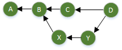

* It's a *graph* in that it has vertices and edges
  (or points and lines if you prefer).
* It's *directed* in that each edge has a direction
  (indicated by an arrow).
* It's *acyclic* in that you can't traverse a cycle (or loop)
  by following the edges in their prescribed direction.

A Git tree is a DAG where the vertices are commits and the lines
represent changes from one commit to the next.  The direction of
the Git arrows are reverse of what one typically sees in a source
control tree: *Git arrows point to the past, not the future*.
In the figure above, `A` is the initial commit.  `B` is a commit
from which two branches emanate.  `D` is a merge commit.

It's good to draw the DAGs on paper as you initially work through
branch and merge scenarios.  After a while you start to see them in
your head and there is less need to write them down.
Since a branch is simply a pointer into our DAG commit tree,
it's helpful to work through a branch/merge scenario and observe
how the structure of the DAG and branch pointers change.
But first, a quick note on branch names.

### Branch Names

There is no "special branch" in Git from a technical standpoint.
But there is a very popular convention of using a branch named
`master` for the main branch.  When a repository is initialized,
a `master` branch is created by default.

**HEAD** is technically a branch pointer (whereas branches are
commit pointers).  So `HEAD` is a pointer to a pointer.  In
practical terms, `HEAD` determines "which branch you're on".
We can also see this in implementation terms by peeking
directly into the Git repository (inside the `.git` folder).

```
$ cat .git/HEAD
ref: refs/heads/master
$ cat .git/refs/heads/master
5567a3e7b3724d116a9d7344d412aaf7ff2aba4c
isabmbp1:~/pix/cloverleaf/git/site$
```

The file `HEAD` contains a reference to a branch, in this
case `master`.  The file `.git/refs/heads/master` points
to a commit.

### Basic Scenario

Let's say we have the following commit tree.
The green circles represent commits.  I've used capital
letters instead of commit hashes to label them.
There are two commit so far, `A` and `B`.

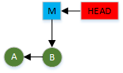

Branches are represented by blue boxes.  In the
present case, there is only the `master` branch
which is represented by `M`.  `master` is the active
branch because `HEAD` is pointing to it.

```
isabmbp1:~/somewhere/workflow$ git logdate
* 89e5100 2017-04-07 [Paul Glezen] Added introduction.
* b668882 2017-04-07 [Paul Glezen] Initial version
isabmbp1:~/somewhere/workflow$ git branch
* master
```

In this example

* commit `B` corresponds to `89e5100`
* commit `A` corresponds to `b668882`

Let's create a new branch named `B1` in order to begin
some new work.

```
isabmbp1:~/somewhere/workflow$ git checkout -b B1
Switched to a new branch 'B1'
isabmbp1:~/somewhere/workflow$ git status
On branch B1
nothing to commit, working tree clean
```

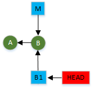

No changes of commits occurred, just pointers.
This is actually shorthand for two commands:

```
git branch B1
git checkout B1
```

The first created the `B1` square.  The second moved
`HEAD` to point to `B1`.  The `-b` in the short-cut
caused the branch creation; otherwise it is an error
to `checkout` a branch that doesn't exist.

Now I'll edit the document and commit again.

```
isabmbp1:~/somewhere/workflow$ git branch
* B1
  master
isabmbp1:~/somewhere/workflow$ vi readme.md
isabmbp1:~/somewhere/workflow$ git add readme.md
isabmbp1:~/somewhere/workflow$ git commit -m "Added design section."
[B1 4e9d53e] Added design section.
 1 file changed, 4 insertions(+)
```

The response from the commit message indicates the commit was added
to `B1` and that its hash starts with `4e9d53e`.  This corresponds
to commit `X` on the diagram.

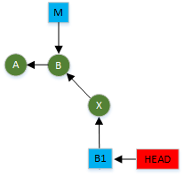

I drew the `X` commit at an angle to express my intention that
this commit is a branch separate from `master`.  But there is nothing
in the graph that makes this so.  I just drew it this way.
Let's reconcile the logs and the branch pointers.

```
isabmbp1:~/somewhere/workflow$ git logdate
* 4e9d53e 2017-04-07 [Paul Glezen] Added design section.
* 89e5100 2017-04-07 [Paul Glezen] Added introduction.
* b668882 2017-04-07 [Paul Glezen] Initial version
isabmbp1:~/somewhere/workflow$ git branch -v
* B1     4e9d53e Added design section.
  master 89e5100 Added introduction.
```

The asterisk next to `B1` in the `git branch -v` output shows that
`B1` is still our current branch.  `master` is still pointing to
commit `B`; but `B1` has advanced to commit `X`.

I make one more change to fix typos and commit.

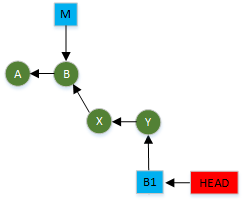

I'm done and ready to merge this to the `master` branch.
Merging is *always* done relative to the target branch.
In this case, the target is `master`.  So I need to
change to the `master` branch.

```
$ git checkout master
Switched to branch 'master'
$ git branch
  B1
* master
```

When we changed to the `master` branch, all the files in the
working copy changed, too.  If we peek into our files, all
the changes we added on the `B1` branch are no longer visible.

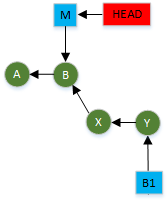

Now merge the `B1` changes to `master`.

```
$ git merge B1
Updating 89e5100..32b8636
Fast-forward
 readme.md | 4 ++++
 1 file changed, 4 insertions(+)
```

Notice the phrase `Fast-forward`.  This means it was a
"trivial" merge.  Instead of merging one set of changes
into another set of changes, we only had one set of changes
to begin with.  This amounts to simply advancing the
`master` pointer.

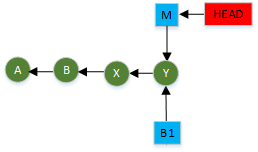

This is fairly common.  You create a branch on which to undertake
a change to prepare for the *possibility* other work might occur
concurrently.  But when it comes time to merge, you learn that no
other commits have been made on `master`.  So at the end of the
day, it doesn't look like a merge at all.

But what if there had been a commit to `master` before the
attempt to merge.  The picture below shows this scenario.  
Of course, we don't usually have such a picture beforehand.
How do we determine what has happened on each fork?


The `git log` command supports a "double-dot" syntax that specifies
set difference.

```
$ git logdate master..B1
* 32b8636 2017-04-07 [Paul Glezen] Fixed typos.
* 4e9d53e 2017-04-07 [Paul Glezen] Added design section.
```

The expression `master..B1` means the following.

1. Start with the commit at `B1`, follow the arrows all the way to
   the end, and consider this the "B1 set".
2. Start with the commit at `master`, follow the arrows all the way
   to the end, and consider this the "master set".
3. Perform set subtraction: remove all elements in `master` from `B1`.
4. Print log entries for whatever elements are left.

Looking up at the diagram, we see this amounts to precisely those commits
that are part of the `B1` branch, but not the `master` branch.  These are
the changes to be **merged from**.  We can see from the output there are
two commits on `B1` since the branch from `master`.

What about the **merged to**?  We just flip the arguments.

```
$ git logdate B1..master
* f092565 2017-04-07 [Paul Glezen] Added Favorite to title.
```

This is consistent with the diagram.  There has been one commit to `master`
since `B1` branched off.  Because this set is **not empty**, there will be
no possibility of a fast-forward merge.

```
isabmbp1:~/somewhere/workflow$ git merge B1
Auto-merging readme.md
Merge made by the 'recursive' strategy.
 readme.md | 4 ++++
 1 file changed, 4 insertions(+)
```

This merged the changed lines in `B1` to the lines that changed
in `master`.

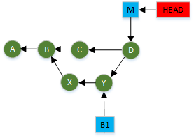

This was painless because the changed lines from `B1` were **different**
from the changed lines in `master`.  If both branches had changed the
same line, that would have introduced a *merge conflict*.  These have to
be resolved manually.  But that's a topic for next week.

The log command gives us the following picture.

```
isabmbp1:~/somewhere/workflow$ git logdate
*   f77e769 2017-04-07 [Paul Glezen] Merge branch 'B1'
|\  
| * 32b8636 2017-04-07 [Paul Glezen] Fixed typos.
| * 4e9d53e 2017-04-07 [Paul Glezen] Added design section.
* | f092565 2017-04-07 [Paul Glezen] Added Favorite to title.
|/  
* 89e5100 2017-04-07 [Paul Glezen] Added introduction.
* b668882 2017-04-07 [Paul Glezen] Initial version
```

Not bad for the command line. From a coding perspective, we're done.
But from a house cleaning perspective, we still have that `B1` pointer
hanging around, even though we don't need it anymore.  Just remove it.

```
isabmbp1:~/somewhere/workflow$ git branch
  B1
* master
isabmbp1:~/somewhere/workflow$ git branch -d B1
Deleted branch B1 (was 32b8636).
isabmbp1:~/somewhere/workflow$ git branch
* master
```

Deleting branches makes people nervous.  But we're not really
deleting the branch; we're deleting the pointer that created
the branch.  We can still reach either branch from commit `D`.
And we *do* have a pointer to commit `D`; namely `master`.
If we removed the `master` pointer, we'd be in trouble.
According to the diagram, there would be no way to find
the end of the branch.  It would sure be unfortunate if that
happened by accident because a Git presentation told you that
it's OK to delete branches on a whim.  Let's see what happens.

```
git branch -d master
error: Cannot delete branch 'master' checked out.
```

So it won't let me delete a branch that I've got checked out.
That's good.
But what if it was another branch on which I had worked but
not merged and don't have checked out.

```
isabmbp1:~/somewhere/workflow$ git checkout -b B2
Switched to a new branch 'B2'
isabmbp1:~/somewhere/workflow$ vi readme.md
isabmbp1:~/somewhere/workflow$ git add readme.md
isabmbp1:~/somewhere/workflow$ git commit -m "Work done."
[B2 c74fb9b] Work done.
 1 file changed, 2 insertions(+)
isabmbp1:~/somewhere/workflow$ git checkout master
Switched to branch 'master'
isabmbp1:~/somewhere/workflow$ git branch -v
  B2     c74fb9b Work done.
* master f77e769 Merge branch 'B1'
```

Now we have

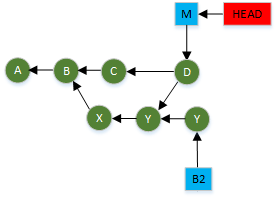

We thought we merged `B2`; but we didn't (and didn't bother to
to perform the easy check of `git log master..B2`).

```
isabmbp1:~/somewhere/workflow$ git logdate master..B2
* c74fb9b 2017-04-07 [Paul Glezen] Work done.
isabmbp1:~/somewhere/workflow$ git branch -d B2
error: The branch 'B2' is not fully merged.
If you are sure you want to delete it, run 'git branch -D B2'.
```

There you have it.  Git will warn you that the branch is not
fully merged.  If you still insist, you can use the `-D`
delete option instead of just `-d`.  One reason to force a
delete is because you accidentally committed a huge file to
the repository and you don't want it to be part of the permanent
commit history.  Avoid merging the commit and remove its branch
pointer.  That will leave a dangling commit in the repository that
still exists, but has no pointers.  Eventually Git will clean this
up (delete unreferenced commits from disk).  It waits about 60 days
in case you feel compelled to get it back
(see [git reflog](https://git-scm.com/docs/git-reflog)).


### Cautionary Note on Hierarchical Branch Names

Some times forward slashes are used
to organize branches hierarchically (e.g. `da/issue23` or
`pubdef/issue45`).  Using hierachical branch names works fine
so long as you observe the following **cautionary note**.
Under the covers (i.e. in the `.git/refs/heads` folder), each
branch pointer name is also a file name.  This file simply
contains the SHA1 hash of the commit it references.  If your
branch name contains a slash, then the file name is really a path
name containing directories relative to `.git/refs/heads`.

```
$ git branch --list lasd/*
  lasd/gards
  lasd/juvwrnt
$ cat .git/refs/heads/lasd/gards
143449187ae79e04122045b38353b13fae3fbb4b
```

In the example above, I listed only branches related to `lasd`.
We can see that under the covers, it's a very small file containing
the SHA1 hash of the commit (i.e. its commit pointer).

The problem that can happen is if someone later decides to create
a branch named `probation` to do all probation work.  That becomes
a **file** named `.git/refs/heads/probation`.  Then later, they
try to create a `probation/issue28`.  This attempts to create a
**directory** named `probation` with a file named `issue28` inside
it.  This results in an error because there is already a file
named `probation`.

As long as you keep this restriction in mind, hierarchical branch
names work fine.

***
End of Workshop 1
***

## Merge Conflicts

Workshop 1 ended with the topic of [branches](#branches).
We saw how easy it was to create a branch.  A good analogy
would be the difficulty associated with jumping out the window
of a building.  The "jumping out" part would be analogous to
"creating a branch."  Most people achieve that much without
much pain.  Landing is a different thing altogether.  Without
a certain amount of planning, landing can go very badly.  In
fact, most people avoid jumping out windows of buildings
solely based on the complications involved with landing,
even though the jumping and falling part is easy and even fun.

A **merge** is to a **branch** as *landing* is to a *jump*.
Without some amount of planning, it can be messy and go badly.
Many people wish to avoid merges altogether and thus avoid
branches altogether.  It doesn't have to be this way.  Git
encourages simple short-lived branches that are usually easy
to merge (like jumping out a first floor window).  We saw
the simplest case in Workshop 1 with the fast-forward merge.
In that case, a branch was created, completed, and merged
before any other commits were made to the `master` branch.

The next level of complexity is when two branches edit

* different files, or
* the same file, but in different places.

In this case, the Git `merge` command will handle this
automatically.  It will create a *merge commit* vertex in
the DAG that points back in to the two source vertices.
We saw this at the end of Workshop 1.  In this section, we're
going to examine the case where the same line of the same file
is changed by both branches.  This is a *merge conflict*.
It can't be resolved automatically (except by specifically indicating
to the command that one side or the other is always right).
Rather, we must edit the conflicted files and manually determine
how to resolve each conflict.  This seems nasty.  But it's not
so bad once you dig in to understand what's going on.

***

Enough chit-chat.  Let's dig in.  We have the scenario in the
diagram below with two files.

* `file1.txt` - a set of mapping entries
* `file2.py` - a simple Python script


The `B3` branch makes some mapping changes to codes that start
with `c` and `e`.  The `master` branch makes changes to codes
that start with `a` and `c`.  We can expect conflicts with
codes that start with `c`.

Meanwhile, for the Python file, only `master` is suppose to change
it by replacing a triple quote mechanism multiple prints.  The `B3`
branch is suppose to leave `file2.py` alone.  But `B3` inadvertently
added spaces to the indention (a common problem with collaborative
Python programming).

Since we want to merge `B3` into the `master` branch, we made
`master` the current branch.  We then run the `git merge` command.

```
$ git branch
  B3
* master
$ git merge B3
Auto-merging file2.py
CONFLICT (content): Merge conflict in file2.py
Auto-merging file1.txt
CONFLICT (content): Merge conflict in file1.txt
Automatic merge failed; fix conflicts and then commit the result.
isabmbp1:~/somewhere/c2$ git status
On branch master
Your branch is ahead of 'origin/master' by 1 commit.
  (use "git push" to publish your local commits)
You have unmerged paths.
  (fix conflicts and run "git commit")
  (use "git merge --abort" to abort the merge)

Unmerged paths:
  (use "git add <file>..." to mark resolution)

	both modified:   file1.txt
	both modified:   file2.py

no changes added to commit (use "git add" and/or "git commit -a")
```

Cancel lunch, it's going to be a loooooong day!
Not necessarily.  Let's assess the damage.  First of all, note the
message that "no changes added to commit".  So we haven't screwed
anything up yet (though we still have some potential for that.)
Under **Unmerged paths:** it tells us that two files were modified.
That's Git's way of informing you that it added merge markers.
Let's take a look at those in `file1.txt`.

```
     1	# This file contains mappings.
     2	#
     3	aa - 30
     4	ab - 53

     5	<<<<<<< HEAD
     6	ca - 39, 40
     7	cb - 35
     8	cc -   44
     9	=======
    10	ca - 39, 41
    11	cb - 36
    12	cc - 44
    13	>>>>>>> B3

    14	ea - 55
    15	eb - 29
```

First the good news: the first and third sections look fine.  The
auto-merge worked since there were no conflicts.  The only trouble
is with the middle lines that were changed by both branches.
Lines 5 and 13 delineate the conflict zone.  In a large file they
won't be so obvious.  But you can find them by searching for lines
that begin with `<<<<<<<` and `>>>>>>>`.  This delineated section
of the file relates the he-said-she-said of the merge conflict.
The `HEAD` section refers to `master` since we're on `master`.
The bottom section is labeled `B3` because that's the source branch
of the merge.  Our task is to resolve the conflicts.

1. In lines 6 and 10, we see that `master` added `40` while `B3`
   added `41`.  We determine that they are both necessary.  So
   we add 41 to line 6 and delete line 10.
2. In lines 7 and 11, `master` changed the `cb` code to 35 while
   the `B3` branch changed it to 36.  After conferring with the
   business, we determine that 36 is the proper code.  So I
   delete line 7 and keep line 11.
3. Line 8 looks like accidental spaces added.  Delete line 8
   and keep line 12.

Now the conflict portion of the file looks like this.

```
<<<<<<< HEAD
ca - 39, 40, 41
=======
cb - 36
cc - 44
>>>>>>> B3
```

We are done resolving the conflicts for this section.
Since these conflicts have been resolved, we should
delete the three conflict markers (otherwise they would
be committed as part of the file).

This fixes `file1.txt`.  In real life there might be
many more of these inside the file.  But it's the same
process for each conflict - choose the right option
and delete the wrong one.  Now let's move to `file2.py`.

```
     1	def print_usage():
     2	<<<<<<< HEAD
     3	   print("Usage: addAudit.py [-f] [-v] <filename ...>")
     4	   print("  -f - overwrite when duplicate key encountered")
     5	   print("  -v - verbose")
     6	   print("  <filename ..> the name of at least one audit file.")
     7	=======
     8	    usage = """"Usage: addAudit.py [-f] [-v] <filename ...>"
     9	     -f - overwrite when duplicate key encountered
    10	     -v - verbose
    11	     <filename ..> the name of at least one audit file."""

    12	    print(usage)
    13	>>>>>>> B3

    14	print_usage()
```

This is a *degenerate* case where the `HEAD` branch was the only
branch that should have changed the file.  The `B3` change was an
accident made by an over-zealous text editor.  This makes the conflict
resolution easy.

1. Delete the `B3` section.
2. Delete the three conflict markers.

If we run `git status` again, we still see the same message about
"Unmerged paths."  We have indeed resolved the conflicts.  But
we need to explicitly inform Git that we have resolved the conflicts
to our satisfaction.  **Resolved conflicts are communicated to Git
through the `git add` command**.

```
isabmbp1:~/somewhere/c2$ git add file1.txt file2.py
isabmbp1:~/somewhere/c2$ git status
On branch master
Your branch is ahead of 'origin/master' by 1 commit.
  (use "git push" to publish your local commits)
All conflicts fixed but you are still merging.
  (use "git commit" to conclude merge)

Changes to be committed:

	modified:   file1.txt

isabmbp1:~/somewhere/c2$
```

Note that in our initial `git status` (before conflict resolution)
both `file1.txt` and `file2.py` were listed as modified.  The
status message above indicates that only `file1.txt` has changed.
Technically this is true since we opted to incorporate all of
`file2.py` from `master` and none from `B3.`  From the `master`
perspective, the `file2.py` changes already belong to the staging
area.  But it was still necessary to specify `file2.py` in the
`git add` command to indicate its merge conflict had been resolved.

When we run `git commit`, the default commit comment is shown below.
Remember that lines beginning with `#` are comments (not added to
the comment; just provided by Git as information).
```
Merge branch 'B3'

# Conflicts:
#       file1.txt
#       file2.py
#
# It looks like you may be committing a merge.
# If this is not correct, please remove the file
#       .git/MERGE_HEAD
# and try again.
```

This might be a sensible default.  But if the merge
required picking one side over another, this would
be a good place to explain those decisions.

## Remotes

You've been learning a lot about how to work with Git and you
still haven't seen how you share your work with a server.  This
is because you generally do more harm than good unless you
understand commits, branches, and the commit graphs that
we have been discussing.

A Git **remote** is an alias for the location of another
Git repository.  The *other* repository can be

* in another folder on your workstation,
* on an external drive, or
* a network location.

When Git, on your workstation, communicates over a network to
another Git instance on another workstation, it uses a standard
transport such as SSH or HTTPS (HTTP/SSL).  This is a huge benefit
over other source control tools that usually communicate via
proprietary network protocols that raise the eyebrows of firewall
admins.  Git uses the same secure transport that one uses for
browsing secure web sites or securely connecting to administrate
server infrastructure - making it **very firewall friendly**.


### Clone

If you clone a repository from another location, Git automatically
defines a remote named `origin` that points to the source of the
clone.  It does so under the premise that if you cloned from
somewhere, it's likely you'll want to communicate with the source
again later, either to push back your changes or fetch updates
from the source.

```
$ git remote -v
origin	https://github.com/lacounty-isab/workshops.git (fetch)
origin	https://github.com/lacounty-isab/workshops.git (push)
```

There are several things worth observing here.

* A single remote can have two entries: one for push (output) and
  one for fetch (inbound).  Usually these are the same.
* The protocol is https.
* The repository URL ends with `.git`.  This is another
  Git-specific convention to denote a *bare repository*.

A *bare repository* is a repository with no associated working
copy.  Recall at the beginning of Workshop I that on our workstations,
the repository files we see and edit are part of the working copy.
The repository itself is inside the `.git` folder.  A bare
repository is just that: a `.git` folder and nothing else.
That's typical for a server copy of the repository since no one
should be editing files on a server.

***

**Exercise**: Clone one of your local repositories to a bare
repository using the following syntax.

       git clone --bare  <source> <target>

Peek into the <target> directory.  You should see the guts of a
Git repository rather than your familiar working copy files.

****

Now you may remember that we didn't furnish the `.git` suffix
when we originally cloned the repository from GitHub.  I believe
it works because GitHub is configured to append the `.git` when
it's missing (i.e. their web server hooks that broker the HTTPS
requests to Git will add this if it's missing).


### Remote DAG

In Git Workshop 1 we covered how the Git commit set is a DAG
(Directed Acyclic Graph) and *branches* were just pointers into
this graph.  When working with a remote repository, we have to
be mindful of *two* DAGs, one for the local and one for the
remote.  Ideally they are the same set of commits.  But as
commits are made to one repository, it becomes out of sync
with the other.  To track this disparity, Git maintains a set
of remote pointers for a repository.  A *remote pointer*
**attempts** to track corresponding pointers on a remote
repository.  Because most pointers are branches, such
remote pointers are called *remote tracking branches*,
or simply **tracking branches**.
Tracking branches are designated as such through a special
naming convention: their names always begin with the name
of the remote to which they are associated.  So if we have
a remote named `origin` and the remote repository has a
branch named `master`, then the remote tracking branch is
named `origin/master`.

Of course, a tracking branch can't always be accurate.  There
is no notification that a commit occurs on a remote
repository.  When a commit is made to a remote repository,
the tracking branch is necessarily out of date until it is
explicitly refreshed.  It's important to understand
conceptually that `origin/master` is **not** a pointer
to `master` in the remote repository.  It's a pointer into our local
repository recording the **last known position** of `master`
in the remote.  But it could have been changed.

So far, this explanation has been abstract.
Let's review the concepts with pictures.

The following figure shows the initial scenario with three
copies of a repository.

* __R__ represents a "server copy" that would be shared
  among participants.  It is bare (no working copy).
* __L17__ represents a local copy used by a developer to
  work on chapter 17 of a book.
* __L21__ represents a local copy used by a developer to
  work on chapter 21 of a book.

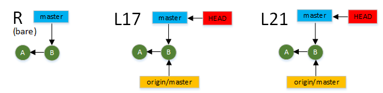

As before in previous sections, the green circles represent
commits and the blue rectangles represent branches (which
are just pointers to commits).  The concept introduced in
this diagram is the tracking branches in orange.  They've
been there all along, but by default, the
`git branch` command does not list them.  You need to use
the `-a` option for "all branches".

```
dal17$ git branch -av
* master                6c835a4 Initial version.
  remotes/origin/HEAD   -> origin/master
  remotes/origin/master 6c835a4 Initial version.
dal17$
```

We see from the output above that it shows

* the `master` branch with an asterisk indicating it is
  the current branch
* the `origin/HEAD` pointer provides a default branch to
  use for remote operations.
* the `origin/master` tracking branch that tracks the `master`
  branch on the `origin` repository.  The commit hashes show
  that the remote and local `master` currently point to the
  same place.

A few notes about these.  You can safely ignore the second entry.
It's used by Git to provide a default branch for when remote
operations are performed without specifying a branch.  I believe
this is foolhardy; we'll be explicitly specifying a branch for
all remote operations.

The list prefixes all remote branches with `remote`.  Git doesn't
require this except in some esoteric circumstances; so we usually
leave it off.

The next figure shows two developers working in their respective
workspaces.  Each one has added a commit to their local `master`
branch.  We can already see trouble brewing.  Note how the
`master` pointers have moved while `origin/master` pointers have
not.

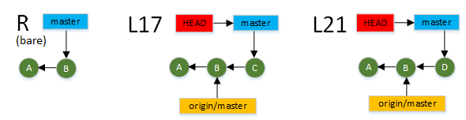

Now L17 executes the `git push` command to push the `C` commit
to the shared repository.

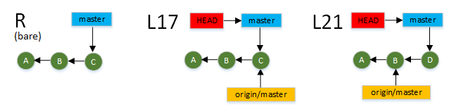

Commands like `git push` impact **two** repositories.  It
successfully added commit `C` to the shared repository and
updated the `master` pointer on the shared repository.
Meanwhile, L17's local repository tracking branch
`origin/master` was updated to reflect the update.

Now L21's `origin/master` is out of date.  This is not
usually a problem, except that the diagram above shows
L21 is about to attempt to add `D` on to the end of
the shared repository `master`.  This `git push` (by L21)
will fail because `D` cannot be added to the end of the
shared `master` consistently.  The L21's only option is to

1. Curse L17 for being first.
2. Fetch the `C` commit into local repository.
3. Merge `C` with `D` in local repository, producing a new
   merged commit representing a consistent combination of both.
4. Attempt another `git push`.

But what if during that time L17 has pushed another change?
L21's push will again fail and possible result in an act
of workplace violence.

Let's back-up, impose some discipline and the use of branches.
This time an agreement is reached that only L17 is allowed
to commit to `master`.  Anyone else must create a new branch
to contribute commits.  With this agreement in place, both
L17 and L21 developers do their work.  L21 has created branch
`i42` to represent her changes.

Before anyone attempts remote operations, the repositories
look like this.

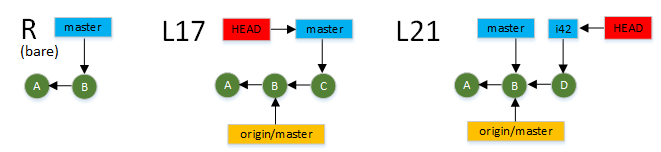

Now each developer pushes their change to the shared repository.
L17 pushes `master`; L21 pushes `i42`.

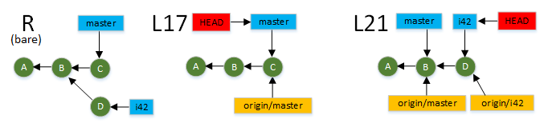

Note the following impacts.

* the shared repository has all changes.
* the L21 repository has a new tracking branch `origin/i42`
  to track `i42` on the shared repository.
* both parties can continue in this manner without
  affecting the other.
* there are three different sets of contents for the same
  repository.

At some point, the L17 developer decides to merge the L21
changes into the master branch.  L17 and L21 developers
have communicated about this.  The first step is for
L17 to fetch the `i42` branch from the shared repository.
This is the result of L17 running

```
git fetch origin i42
```

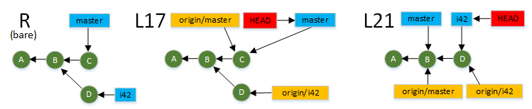

We see that L17 now has a tracking branch `origin/i42`.
L17 could also create a local branch for `i42`.

```
git branch i42 origin/i42
```

But this is unnecessary and not shown here.  What is
far more important about the figure above is what did
**not** happen.  Namely

* The `HEAD` pointer did not change.  L17's current
  branch is still `master`.
* L17's working copy was not affected.

There was absolutely no impact of this fetch on L17's
workflow.  The only evidence to L17 that anything occurred
is the presence of the tracking branch.  **This is a big
deal!**.  Fetching commits from others does **not** disrupt
anything you're currently doing.

The L17 developer prepares for the merge of L21's work
by completing and committing current work.  This is commit
`E`.


L17 merges L21's changes and resoles any conflicts
that might have occurred. This creates a merge commit `F`.
No pushing or fetching has been done; so none of
the tracking branches have changed.

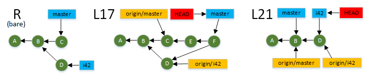

L17 pushes its `master` branch to the shared server.

```
git push origin master
```

Since L17's `master` points to `F`, this pushes
`F` to the shared repository along with every commit
traceable from `F` that isn't already in the shared
repository.  In this case this amounts to pushing
`F` and `E`.  This push updates L17's tracking branch
`origin/master`.  It also updates the shared repository
`master`.

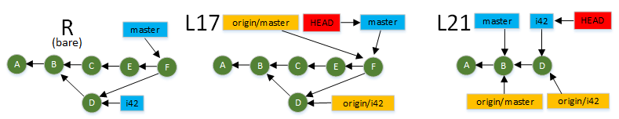

The L17 developer notifies the L21 developer that the
merge is complete and available.  L21 updates her
repository with the last commit from the shared `master`.

```
git fetch origin master
```

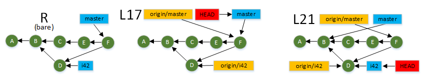

As explained before, a `git fetch` does not disrupt
anything for L21.  Her local `master` pointer still
points to the `B` as before.  Her current branch is
still `i42` and her working copy is in the same state
as when she pushed her `i42` updates.  The updates
that are so obvious on this diagram are hidden in
the `.git` folder and only referenced by the tracking
branch `origin/master`.

In order to update her working copy with the latest
merged copy, L21 changes to her `master` branch and
updates it from the tracking branch.

```
git checkout master
git merge origin/master
```

The first command points `HEAD` to `master` and replaces
her working copy with repository at commit `B` (because
that's where `master` points).  If L21 views her working
copy after the first command but before the second command,
she'll see none of the work committed in `D`, `E`, and `F`.

The second command "merges" the tracking branch into the
local branch.  But this should always be a "fast-forward"
merge (basically just advances the pointer).

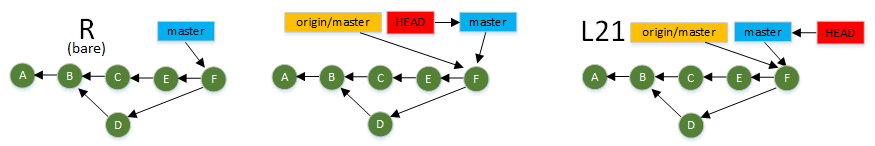

At the point L17 and L21 have the same working copy.
The `i42` branch pointers are no longer required.
To clean things up, they are deleted.

---

This was a concurrent development scenario examined in
excruciating detail.  The most common mistakes Git newcomers
make when working across multiple repositories are

* to confuse branches (pointers) with the same name
  across multiple repositories.
* think only in terms of their own commit tree instead
  of trees in other repositories.
* forget that local branch pointers only move during
  a commit; tracking branch pointers only move during
  a push or fetch.

It's a good idea to draw your Git DAG on scratch paper
as you branch and merge to establish an intuition for
the impact of Git commands.  After enough practice you
begin to dream in terms of DAGs; writing them down is
no longer necessary.

### Fetch

The `git fetch` command fetches updates from a remote repository
to your local repository.  
