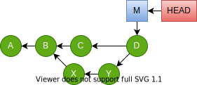
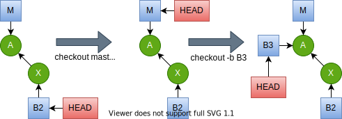
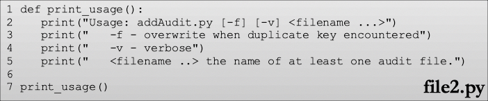

# Git

This workshop introduces the Git source control tool to new users
at Los Angeles County.  Because there are many excellent freely available
Git references, there is little point attempting another one from
scratch. Rather, this is intended as a guide through the available
references along with descriptions of how we apply these concepts
for certain Git repositories managed by ISAB.

It's important to become comfortable with the references.
You should bookmark the ones you find useful and refer to them first
when you have questions.  Then, if necessary, seek help from others for
clarity on the documentation rather than as a substitute for the
documentation.

For Git, a great place to start for information is

<https://git-scm.com/doc>

In particular, the book [Pro Git](https://git-scm.com/book/en/v2)
is freely available to download or browse on the web.  Updated
[command references](https://git-scm.com/docs)
are also available there.

This document is an outline used to guide a pair of workshops.

**Week 1**

* [Installation](#installation)
* [Initialization](#initialization)
* [Basic Lifecycle](#basic-lifecycle)
* [Log and Diff](#log)
* [Branches](#branches)

**Week 2**

* [Merge Conflicts](#merge-conflicts)
* [Remotes](#remotes)
* [Tags](#tags)
* [GitHub](#github)
* [Cloverleaf Lifecycle](#cloverleaf-lifecycle)

## Installation

Most county employees will be running Git on a Windows workstation.
The Git installer for Windows is available for free download from

<https://git-scm.com/download/win>


After installation, check that the `C:\Program Files\Git\cmd`
directory is in your `PATH` variable.  You can add it manually
through the following steps:

1. Open Control Panel.
2. Choose the **System** section.
3. Choose **Advanced system settings**.
4. Choose the **Advanced** tab.
5. Click the **Environment Variables** button.
6. Under **User variables** select `PATH` and click **Edit**.
7. Add the path to the entry.  The separator is a `;`.
8. Click **OK** to dismiss the windows and close Control Panel.
9. Exit and restart the command window.

You can check your work with

```console
echo %PATH%
```

to see that your PATH variable was changed.

Another fun directory to add to your `PATH` is `Git\usr\bin`.
That gives you some Unix utilities and an **ssh** client.

### First Time Setup

First time setup is described well in the
[Pro Git book](https://git-scm.com/book/en/v2)
under the section
[Getting Started - First-Time Git Setup](https://git-scm.com/book/en/v2/Getting-Started-First-Time-Git-Setup)
The most important section is setting your `user.name`
and `user.email` properties.

```console
git config --global user.name "John Doe"
git config --global user.email jdoe@somewhere.gov
```

The `--global` flag sets the property in your global user
configuration file.  You can override this setting on a
per-repository basis.  The choices are

* `--local` - (default) applies property to a particular repository.
* `--global` - applies property to all repositories for a user.
* `--system` - applies across all users.

This is useful when you use a home computer for work projects.
Your `--global` setting would be your personal email. But you
would override a work repository email setting.


By default, Git on Windows uses its own version of **vi** to
edit commit comments.  If this doesn't sit well with you, then
you might want to change it to something else.  Note that your
choice needs to work with Git, like `vi`, `emacs`, or `Notepad++`.
Editors that do **not** work with Git are `notepad` and `write`.
It's also possible to provide a one-line
commit message on the command line.

------------
**Exercise 1 - Setup**

1. Create a new directory on your file system in which to perform the
   activities for the workshop.  This directory will be called
   `GitWorkshop` for the rest of this workshop.

2. Open a command line terminal to `GitWorkshop`.

3. Verify your Git version with `git --version`.  If this fails,
   you need to fix problems with your `PATH` or the installation.

4. Set your name and email in the **global** scope using the commands
   above.

5. Clone the ISAB repository for this workshop to your workstation.

   ```console
   git clone https://github.com/lacounty-isab/workshops isabrepo
   ```

------------

This will **clone** the Git repository hosted on GitHub to your local
file system into a new directory named `isabrepo`.  If you omit the `isabrepo`
parameter on the end, the new directory will default to the base name of the
repository, in this case `workshops`.

Keep this directory handy.  Later exercises will be pulling from parts of it.


### GUI Git

There are a number of
[Git GUI programs](https://git-scm.com/downloads/guis)
available.  Some of
them are standalone; others are part of IDEs (Integrated
Development Environments) like Eclipse (Java), Visual Studio
(.Net), RStudio (R), and others.
The GUIs are mostly good.  But you are strongly encouraged
to understand the Git command line.  There are seveal benefits
to learning the Git command line.

1. Most actions of any GUI tool can be understood in terms
   of the command line.  
2. The definitive Git documentation expresses Git operation
   in terms of Git commands and command line options.
3. You may have to change between various GUI tools; but
   the command line stays the same.
4. When searching for help in public forums (such as
   <https://stackoverflow.com>), questions and answers are
   most easily expressed in terms of the command line.
5. Git commands are easily scripted.

Once you are well grounded in the command line, most GUI Git
tools are easy to learn.


## Distributed vs Centralized

Git differs fundamentally from version control tools popular
15 years ago in that it is a *distributed version control* tool
as opposed to traditional *centralized version control* tool.
Traditional centralized tools include CVS, SVN and ClearCase.
They define a repository a server.  Clients download a
*certain version* to their workspace and work with it.  The other
versions remain on the server only.  Operations such as creating
new project, checking out a different version, comparing versions,
committing new versions or viewing change history of a file
require communication with the server.  Without the server, none
of these operations are possible.

The distributed model stores the entire repository on every
workstation.  This reduces the distinction between "client" and
"server" to one of convention.  One always commits changes to a local
copy, never to a remote copy.  Those local changes may latter be
synchronized to another remote copy (an operation Git calls `push`).
But all the interesting work occurs locally.

*Remote operations merely synchronize what was already accomplished locally.*

This notion is somewhat abstract at first.  But the concept, as well as
the benefits, will become clearer as we work through the exercises.


## Initialization

There are two ways to add a local Git repository to your workstation:

1. *Init* a new repository to track files on your workstation
   that are not currently under source control.

2. *Clone* an existing repository from somewhere else to your
   workstation.

### init

The Git `init` command creates a new repository.  It's normally used
to create a new local repository for files you wish to place under
source control.  This is much simpler than with CVS and SVN, where
you must first create a repository on a server (even if you're hosting
the server on your own machine), upload the files to the server, then
create a **new** directory in which to work with the files you just
uploaded.

With Git, you simply run the `init` command in the directory
that holds the working copy.


```console
git init
```

That creates an *empty* local repostory.
The left side of the figure below shows the repository in red.
The entire repository resides in a folder named `.git` that is
a child of the project root directory.  It's important to understand
that the files in black are **not** part of the repository.  They
are called *the working copy*.  At times they may be consistent with
a version in the repository.  But they are expected to drift out of
sync with the repository as we make changes.  When we *commit* these
changes, they are written to the repository.


Let's examine some differences between a local Git repository on
your workstation and that of a checked-out SVN project.
A corresponding workspace for SVN is
shown on the right side of the above diagram.  The SVN metadata is
is kept in `.svn` directories in **every folder of the project**.
(The same is true for CVS and ClearCase).  These folders contain
metadata about how the folder relates to the corresponding folder
on the server.

The next exercise demonstrates how the Git directory model is
more pragmatic.


-------------------------
**Exercise 2 - Init**

1. From the clone of the `workshops` repository, copy the 
   `isabrepo/git/samples` directory to `GitWorkshop`.
   After this, you should have a copy named `GitWorkshop/samples`.

2. Change to the `GitWorkshop/samples` directory in your command line.
   This represents a directory of files from which we want to
   create a new Git repository.

3. Run `git status`.  This is probably the most common Git command
   you'll ever execute.  In this context, it returns an ominous
   message that simply means we are not in the context of a Git
   repository.

   ```
   GitWorkshop/samples$ git status
   fatal: not a git repository (or any of the parent directories): .git
   ```

4. Run `git init`.  This will create an *empty local repository*.
   None of the files in this directory have been placed in this 
   repository.  That will come later.  On Windows, the new `.git`
   folder is harder to verify.  On Linux and macOS, it's apparent
   with `ls -a`.

   ```
   GitWorkshop/samples$ git init
   Initialized empty Git repository in GitWorkshop/samples/.git/
   ```

5. Run `git status`.  Now that you actually have a repository to
   work with, abeit an empty one, Git has more to say.  In particular,
   it's telling us that we have four files that are not yet tracked.

   ```
   GitWorkshop/samples$ git status
   On branch master

   No commits yet

   Untracked files:
     (use "git add <file>..." to include in what will be committed)

   	file1.txt
   	file2.py
   	hg17.txt
   	hg21.txt

   nothing added to commit but untracked files present (use "git add" to track)
   ```

   The remark "nothing added to commit" is alluding to the **staging area**.
   In Git there are three states in which a version of a file can occupy:
   the working copy, the staging area, and a commit.  
   These are shown in the illustration below.
   
   

   The *working copy* of a file is the one in your directory that you can see
   and edit.  The *staging area* is a version of file that is to be committed
   in the next `commit` action.  Committed versions of files are in the 
   commit state.  These are preserved in the commit history.

   The three logical boxes above were created with the `git init` command.
   At the beginning, all files only exist as part of the working copy.

6. For this scenario, let's say we want to commit all the `*.txt` files,
   but delay the `*.py` file.

   ```
   GitWorkshop/samples$ git add *.txt
   GitWorkshop/samples$ git status
   On branch master

   No commits yet

   Changes to be committed:
     (use "git rm --cached <file>..." to unstage)

       new file:   file1.txt
       new file:   hg17.txt
       new file:   hg21.txt

   Untracked files:
     (use "git add <file>..." to include in what will be committed)

   	   file2.py
   ```

   Note the change in the status message.  The status of the files went
   from "untracked" to "to be committed".  These are the files that will
   be added to the repository 

   

   We say these versions of the files are "added to the staging area."

7. Now the `*.txt` files are in the staging area and ready to commit.
   We have excluded the Python script by not staging it.  We are ready to
   run the `git commit`.

   ```
   GitWorkshop/samples$ git commit -m "Initial version."
   [master (root-commit) d5ec68e] Initial version.
    3 files changed, 102 insertions(+)
    create mode 100644 file1.txt
    create mode 100644 hg17.txt
    create mode 100644 hg21.txt
   ```

   Note the `commit` command does **not** refernce any files.  It simply
   commits whatever changes are in the staging area.

   

   This command will commit the changes using the message
   `Initial version`.  This avoids a `vi` session for those of you
   not familiar withe the `vi` editor.  But it limits you to
   commit messages that are a single line.

-------------

At the end of this exercise we still have `file2.py` as an untracked file.
There is no harm in having files in the directory that are not part of the
repository.  We can commit them later or never commit them.

```
GitWorkshop/samples$ git status
On branch master
Untracked files:
  (use "git add <file>..." to include in what will be committed)

	file2.py

nothing added to commit but untracked files present (use "git add" to track)
```

### clone

The `clone` command copies a repository from one location to
another location.  We used it in the first exercise to clone the workshop
repository to our local workstation.  We can also clone locally.

--------------
**Exercise 3 - Local Clone**

1. In your command line, change to the `GitWorkshop` directory.  There
   should be two subdirectories: `isabrepo` and `samples`.  Each of these
   directories holds a Git repository.

2. Clone the `samples` repository locally.

   ```
   GitWorkshop$ git clone samples samples2
   ```

   This
   
   a. creates a clone of the repository and
   b. checked out a working copy from the repository.

   **Note:** There is no Python script because we did not commit that
   to the original repostory.  This reinforces the point that the
   **repository** is copied, **not** the working copy.

3. Change to the `samples2` folder and list the directory.

   ```
   GitWorkshop$ cd samples2
   GitWorkshop/samples2$ ls -a
   ./         ../        .git/      file1.txt  hg17.txt   hg21.txt
   ```

4. Delete the `.git` folder.  It is no longer a Git repository.
   But you still keep your working copy.

   ```
   GitWorkshop/samples2$ rm -rf .git
   GitWorkshop/samples2$ git log
   fatal: not a git repository (or any of the parent directories): .git
   GitWorkshop/samples2$ ls
   file1.txt  hg17.txt   hg21.txt
   ```

5. Change back to the `GitWorkshop` directory and clone the ISAB 
   repository locally.


   ```
   GitWorkshop$ git clone isabrepo repo1
   Cloning into 'repo1'...
   done.
   GitWorkshop$ ls repo1
   crypto/          ds/              octotrooper.png  regex/
   distributions/   git/             readme.md 
   ```

   Notice how fast the local clone happened when there are no network
   calls involved.

6. Make a bare clone of the ISAB repository.  A *bare* repository is
   one with **no working copy**.

   ```
   GitWorkshop$ git clone --bare isabrepo repo2
   Cloning into bare repository 'repo2'...
   done.
   GitWorkshop$ ls repo2
   HEAD         config       hooks/       objects/     refs/
   branches/    description  info/        packed-refs 
   ```

   When we list the contens of `repo2`, it is what we would normally see
   inside the `.git` folder.  Hosting services use bare repositories on
   remote servers where there is no reason to have a working copy.

--------------------

Cloning a repository locally is a good resoure for teaching yourself new
commands and operations.  You can test the operation on a local clone first,
and then apply it to other resositories later.  


## Basic Lifecycle

Many of us have worked with some sort of *centralized* version control
system in the past.  Tools such as **CVS**, **SVN**, and
**ClearCase** have a basic lifecycle of

1. checkout - copy a version to local workspace
2. edit - edit working copy
3. commit - write changes back to server
4. repeat

The server contains the history of every file.  Our workstation contains
a working copy that we can edit.  But anything related to other versions
of files in terms of

* comparing them
* reading their commit comments
* creating branches
* conflict resolution

requires a connection to the server.  This is inefficient even when we
do have good network connectivity.  Git is an example of a
[distributed](https://git-scm.com/about/distributed)
version control system (DVCS).  Every copy of the repository is the full
version history.  There may be an instance that a team calls "the server."
But that's purely by convention.

There is no such thing as a "Git client" that is distinct from a Git
server.  All *checkout* and *commit* commands work on local repositories.
There are commands that push and pull changes between two repositories.
But these changes have to have been committed locally first.  There is
no notion of using a Git client to browse a server.  Rather, you clone
the server repository to a local repository on your workstation and browse
it using your workstation file manager.  This makes repository version
browsing far more efficient.

Once you have a local copy of the repository the basic lifecycle goes
like this.

1. checkout - change to a branch; often create a new one.
2. edit - edit working copy.
3. stage - add the changes to a staging area.
4. commit - commit changes.
5. repeat steps 2 - 4.
6. push commits to a server copy of the repository.

Note that in the case of a local-only repository, step 6 never happens.
The commands used in the basic lifecycle are discussed in more detail below.

Reference is often made to **HEAD**.  This is a pointer that refers to
the place in the commit tree where the next commit will be applied.


### Git commit

Because so much preparatory work goes into populating the staging area with
exactly what we want to commit, the `git commit` command is very simple.  But
there are a few things to keep in mind.

#### Commit Comments

Each commit should have a comment describing the commit.  It may be as brief
as "Initial commit."  Or it might go on for several paragraphs.
The following conventions apply to Git comments.

1. The first line should be a brief summary with fewer than 50 characters
   and end with a period.  That's because many reporting tools summarize
   Git commit comments using the first line only.  These reports look
   nicer if the summary is short.
2. If there are more details to provide, start the details on the third
   line.  The second line should be blank.
3. Comment lines starting with line 3 have no convention for length.
   But generally it's good to keep them under 100 characters.

Generally you do **not** need to provide

* __the date__ - this is provided automatically
* __the author__ - this defaults to the committer; but there is a `commit`
  option to specify a different author than the committer.  (See below)
* __the changed files__ - this is obtainable through other Git commands;
  it does not *need* to be part of the commit message.  But this is only
  a convention; you may add a file list if you feel so inclined.

 To add a commit on behalf of another author, use the `--author` option.

```
git commit --author "Mai Kaleegh <mkaleegh@agcy.place.gov>"
```

The commit record will still register you as the committer.  But the author
field will be Mai Kaleegh.

#### Comment Editor

The first response of the `git commit` command will be to start an editor
in which you add the commit comment.  By default, this is a **vi** editor.
On Windows, this editor is installed with Git.  You can change this editor
as mentioned in [First Time Setup](#first-time-setup).  But it has to be
an editor that can communicate with Git (e.g. not Windows Notepad or Write).

If your comment is a single line, you can do this on the command line with
the `-m` flag.

```
git commit -m "My one line commit comment."
```

When invoked this way, no editor is started since the commit comment is already
provided.

----------------
**Exercise 4 - Second Commit**

In this exercise we're going to reinforce the basic lifecycle
with another commit.  We'll continue using the `GitWorkspace/samples`
directory.  At this point, we should have the following configuration.


This is the same as the end of Exercise 2, with the addition of
two pointers.

* __master__ - represents a branch.  There is nothing special about this
  branch or its name, other than Git creates one for us with each new
  repository.  It is, however, commonly retained and used.  It's a
  pointer to a commit object, usually the last one in a sequence of
  commit objects representing a branch.

* __HEAD__ - is a bookmark of sorts.  It helps Git determine where to
  apply its commands.  Since we intend for our commands to apply to
  a particular branch, `HEAD` usually refernces a branch pointer rather
  than directly to a commit.  Hence it's usually a pointer to a pointer.

We're going to make two edits in the exercise:

- Change a file that has already been committed.
- Add the Python file that was excluded before.

But first we're going to simulate an accident.


1. Let's say we wish to edit `hg17.txt`.  But somehow it accidently
   got deleted.  Simulate this condition by deleting `hg17.txt`
   yourself.

   

2. Verify with

   ```
   GitWorkshop/samples$ git status
   ```

   The `status` command will be one of your most commonly used commands.

3. Of course `hg17.txt` still exists, both as a commit and within
   the staging area.  The following command will restore `hl17.txt`
   from the **staging area** to the **working copy**.

   ```
   GitWorkshop/samples$ git checkout hg17.txt
   ```

   and verify the status.

4. Open `hg17.txt` inside a text editor.

   ```
   From: <http://www.p2r.se/music/disaster.htm>

   Chapter 17

   The Hitch Hiker's Guide to the Galaxy notes that
   **Disaster Area**, a plutonium rock band from the
   ```

5. Delete the first two lines so that the first line is
   **Chapter 17**.  Then change "Hitch Hiker's" to
   "Hitchhiker's".  Save the file and close the editor.

6. Run the **diff** command to verify your changes.

   ```
   GitWorkshop/samples$ git diff
   diff --git a/hg17.txt b/hg17.txt
   index d330bb2..1e9969d 100644
   --- a/hg17.txt
   +++ b/hg17.txt
   @@ -1,8 +1,6 @@
   -From: <http://www.p2r.se/music/disaster.htm>
   -
    Chapter 17

   -The Hitch Hiker's Guide to the Galaxy notes that
   +The Hitchhiker's Guide to the Galaxy notes that
    **Disaster Area**, a plutonium rock band from the
    Gagrakacka Mind Zones, are generally held to be not
    only the loudest rock band in the Galaxy, but in
   ```

   This will list the changes between the files in the **staging area**
   and their corresponding files in the **working copy**.

   

7. Now that we've verfied our change to this file, let's add it.

   ```
   GitWorkshop/samples$ git add hg17.txt
   ```

8. Try the **diff** command again.  It should show no changes.
   That's because it only compares the staging area to the working
   copy.  If your change has already been added to the staging
   area, it is consistent with the working copy.


   

   To check differences between the staging area and the latest
   commit, add the `--cached` flag.

   ```
   GitWorkshop/samples$ git diff --cached
   ```

   This is not as commonly done.

9. Now let's turn our attention to the Python program that was
   omitted the first time around.  We'll use a short cut to 
   add the Python program.

   ```
   GitWorkshop/samples$ git add .
   ```

   This says add **everything** (recursively) starting with the
   current directory (the `.` means current directory).
   In our case this is what we want.
   But sometimes this can add more than you want.
   It's always good to check the status before committing.
 
10. Run the commit.

    ```
    GitWorkshop/samples$ git commit -m "Added Python and fixed typos."
    ```


The result is a new commit.  (There is only one staging area and
working copy.)


A few things to note:

* The **master** pointer automatically advances.
* Since **HEAD** references **master**, it is implicitly advanced.
* The new commit points backward in time to the old commit.  This is
  another subtle but important difference between Git and tools like
  CVS and SVN.

----------------

#### Short Circuit

If the whole staging area idea doesn't sit well with you, it is possible
to commit changes to files straight from the working copy without manually
staging them.  Just provide the `-a` flag.

```
git commit -a -m "A commit without explicit staging."
```

This command will commit all changes in the working copy.
It is not recommended since it easily leads to versions of files
being committed that were not intended.


## Log

The [git log](https://git-scm.com/docs/git-log) command displays
information about commits.
As simple as this sounds, there is a bewildering number of options
to customize what you see and what you hide.  Here is a basic
form of the `git log` command.

```console
GitWorkshop/samples$ git log
commit 10f629df8aab162c65f80112d2c2406095d8dfc6 (HEAD -> master)
Author: Paul Glezen <bs193538@gmail.com>
Date:   Mon Mar 30 21:02:13 2020 -0700

    Added Python and fixed typos.

commit b83eb9bed3deb85a32b12e7679a18d28765bb0de
Author: Paul Glezen <bs193538@gmail.com>
Date:   Sun Mar 29 13:15:14 2020 -0700

    Initial version.
```

Note the entries are in **reverse** chronological order.

Our training repository is still very small.  In practice
there are usually far more commits than you want to see.
The following exercise provides practice in filtering log
output.


----------------
**Exercise 5 - Log Filtering**

1. In your command line change to the `GitWorkshop/isabrepo`
   directory.  This repository has too many commits to see on
   a single screen.

2. List the last four commits.

   ```console
   GitWorkshop/isabrepo$ git log -4
   ```

   This is the most common way to limit the output.  Forgetting
   this option usually floods your screen as a lesson to remember
   it next time.

3. It's common to abbreviate the output to an entry per line.
   The `--oneline` option does this.

   ```console
   GitWorkshop/isabrepo$ git log -5 --oneline
   ```

4. Most modern installations of git have several log commands
   aliased out-of-the-box.

   ```console
   GitWorkshop/isabrepo$ git config --list | grep alias
   alias.lol=log --pretty=format:"%h %s" --graph
   alias.l=log --graph --all --pretty=format:'%C(yellow)%h%C(cyan)%d%Creset %s %C(white)- %an, %ar%Creset'
   ```
   **Note**: If you don't have the `grep` utility installed, just list
   all the aliases.

5. Try one of these aliased commands.

   ```console
   GitWorkshop/isabrepo$ git l -4
   *   3307dd6 (HEAD -> master, origin/master, origin/HEAD) Merged remote-tracking branch origin/master. - Paul Glezen, 4 weeks ago
   |\
   | * 79e14d9 Distribution supplement from last year; forgot to commit. - Paul Glezen, 6 months ago
   * | f2429ae Minor updates to GPG1. - Paul Glezen, 4 weeks ago
   |/
   * c551df5 Added workshop PDF for GPG 1. - Paul Glezen, 6 months ago
   ```

6. (Optional) If you don't have the `l` alias defined, define it for
   yourself.

   ```console
   git config --global alias.l "log --graph --all --pretty=format:'%C(yellow)%h%C(cyan)%d%Creset %s %C(white)- %an, %as%Creset'"
   ```

   Note the mix of double and single quotes.

   Recall that adding `--global` to the `config` command makes it
   available to all your repositories.  You can run this alias as

   ```
   GitWorkshop/isabrepo$ git logdate -2
   ```

7. Another way to restrict the number commits is through a relative
   time.

   ```console
   GitWorkshop/isabrepo$ git l --since 1.month
   * 3307dd6 (HEAD -> master, origin/master, origin/HEAD) Merged remote-tracking branch origin/master. - Paul Glezen, 4 weeks ago
   * f2429ae Minor updates to GPG1. - Paul Glezen, 4 weeks ago
   ```

8. So far, we've restricted the commit range by time only.
   We can also restrict by files.  We can specify a file or
   a directory so that we only see Git commits affecting
   those components.  The following command lists commits
   that affect files in the `git` directory for the
   last two months.

   ```console
   GitWorkshop/isabrepo$ git log -- git
   ```

   The `--` is a safety mechanism so that `git` is interpreted
   as a file or directory and not the name of a branch.  It's not
   always required; but when you see it, that's what it does.  It
   just separates the command options from the file or directory name.

------------


## Branches

Branches are a very common phenomenon with Git, much more so than
with other source control tools.  This is pragmatic with Git because
a branch is nothing more than a pointer to the commit tree.  The key
to understanding branches is to understand commit trees.  

### DAG

A commit tree is a directed acyclic graph (DAG).
An example of a DAG is shown below.


* It's a *graph* in that it has vertices and edges
  (or points and lines if you prefer).
* It's *directed* in that each edge has a direction
  (indicated by an arrow).
* It's *acyclic* in that you can't traverse a cycle (or loop)
  by following the edges in their prescribed direction.

A Git tree is a DAG where the vertices are commits and the lines
represent changes from one commit to the next.  The direction of
the Git arrows are reverse of what one typically sees in a source
control tree: *Git arrows point to the past, not the future*.
In the figure above, `A` is the initial commit.  `B` is a commit
from which two branches emanate.  `D` is a merge commit.

It's good to draw the DAGs on paper as you initially work through
branch and merge scenarios.  After a while you start to see them in
your head and there is less need to write them down.
Since a branch is simply a pointer into our DAG commit tree,
it's helpful to work through a branch/merge scenario and observe
how the structure of the DAG and branch pointers change.
But first, a quick note on branch names.

### Branch Names

There is no "special branch" in Git from a technical standpoint.
But there is a very popular convention of using a branch named
`master` for the main branch.  When a repository is initialized,
a `master` branch is created by default.

**HEAD** is technically a branch pointer (whereas branches are
commit pointers).  So `HEAD` is a pointer to a pointer.  In
practical terms, `HEAD` determines "which branch you're on".
We can also see this in implementation terms by peeking
directly into the Git repository (inside the `.git` folder).

```console
$ cat .git/HEAD
ref: refs/heads/master
$ cat .git/refs/heads/master
5567a3e7b3724d116a9d7344d412aaf7ff2aba4c
isabmbp1:~/pix/cloverleaf/git/site$
```

The file `HEAD` contains a reference to a branch, in this
case `master`.  The file `.git/refs/heads/master` points
to a commit.

### Basic Scenario

If you've been following the exercise, the `samples` folder
should be a repository with two commits.
The green circles represent commits.  I've used capital
letters instead of commit hashes to label them.


Branches are represented by blue boxes.  In the
present case, there is only the `master` branch
which is represented by `M`.  `master` is the active
branch because `HEAD` is pointing to it.

-------------

**Exercise 6**

1. To prepare for this exercise, which demonstrates
   the first two branch types described above,
   remove the `samples2` directory created during
   Exercise 3.

2. Create a clone of the `samples` repository
   and change to its directory.

   ```console
   GitWorkshop$ git clone samples samples1
   Cloning into 'samples1'...
   done.
   GitWorkshop$ ls
   isabrepo/ repo1/    repo2/    samples/  samples1/
   GitWorkshop$ cd samples1
   GitWorkshop/samples1$
   ```

3. Create a new branch named `B1` and make it the 
   current branch.  Use the `git branch` command
   to verify the branch status before and after
   each step.

   ```console
   GitWorkshop/samples1$ git branch
   * master
   GitWorkshop/samples1$ git branch B1
   GitWorkshop/samples1$ git branch
     B1
   * master
   ```

   At this point we have defined a new branch `B1`.
   But it is **not** the current branch (`HEAD` does not
   point to it).

   

   To make `B1` the current branch, use the `checkout`
   command.

   ```console
   GitWorkshop/samples1$ git checkout B1
   Switched to branch 'B1'
   GitWorkshop/samples1$ git branch
   * B1
     master
   ```

   

   The `branch` and the `checkout` command is often
   combined into a single shortcut command

   ```console
   git checkout -b B1
   ```

   This will **create** the branch `B1` if it doesn't
   already exist, and then **make it the current branch**.
   Whichever method you use, the output from
   `git branch` should be consistent with the figure above.

   ```console
   GitWorkshop/samples1$ git branch
   * B1
     master
   ```

4. Edit `hg21.txt`.  Remove the first two lines that contain a dead
   URL and a blank line.  After editing this file, the first line
   should say "Chapter 21."  Save the change.

5. Commit this change to the **B1** branch.

   ```console
   GitWorkshop/samples1$ git status
   On branch B1
   Changes not staged for commit:
     (use "git add <file>..." to update what will be committed)
     (use "git checkout -- <file>..." to discard changes in working directory)

   	modified:   hg21.txt

   GitWorkshop/samples1$ git add .
   GitWorkshop/samples1$ git commit -m "Pruned dead URL from Ch 21."
   [B1 c2e8b4e] Pruned dead URL from Ch 21.
   ```


   

   I drew the `X` commit at an angle to express my intention that
   this commit is a branch separate from `master`.  But there is nothing
   in the graph that makes this so.  I just drew it this way.
   Let's reconcile the logs and the branch pointers.

   ```console
   GitWorkshop/samples1$ git log --oneline
   c2e8b4e (HEAD -> B1) Pruned dead URL from Ch 21.
   10f629d (origin/master, origin/HEAD, master) Added Python and fixed typos.
   b83eb9b Initial version.
   GitWorkshop/samples1$ git branch -v
   * B1     c2e8b4e Pruned dead URL from Ch 21.
     master 10f629d Added Python and fixed typos.
   ```

   The asterisk next to `B1` in the `git branch -v` output shows that
   `B1` is still our current branch.  `master` is still pointing to
   commit `B`; but `B1` has advanced to commit `X`.

6. Edit `hg17.txt`.  Change `songs` to `compositions` on line 17.
   Save the file.

7. Commit this second change to the `B1` branch.

   ```console
   GitWorkshop/samples1$ git diff
   diff --git a/hg17.txt b/hg17.txt
   --- a/hg17.txt
   +++ b/hg17.txt
   
   -Their songs are on the whole very simple and mostly
   +Their compositions are on the whole very simple and mostly

   GitWorkshop/samples1$ git add .
   GitWorkshop/samples1$ git commit -m "Songs to compositions."
   [B1 81d60de] Songs to compositions.
   ```

   In the example above we ran the `diff` command.  For brevity
   I cut out much of its output.  Then we commit to the **B1**
   branch.  This configuration is depicted below.

   

   It is consistent with the output from the log.  `B1` is
   two commits ahead of `master`.

   ```console
   GitWorkshop/samples1$ git log --oneline
   81d60de (HEAD -> B1) Songs to compositions.
   c2e8b4e Pruned dead URL from Ch 21.
   10f629d (origin/master, origin/HEAD, master) Added Python and fixed typos.
   b83eb9b Initial version.
   ```

8. At this point we've reached a fork in the road where I wish to
   demonstrate two different scenarios.  To this end let's clone
   the current `sample1` repository to `sample2`.

   Change to the parent directory and run the clone command.
   Then change to the `samples2` directory and fetch the state
   of the `master` branch to `samples2`.

   ```console
   GitWorkshop/samples1$ cd ..
   GitWorkshop$ ls
   isabrepo/ repo1/    repo2/    samples/  samples1/
   GitWorkshop$ git clone samples1 samples2
   Cloning into 'samples2'...
   done.
   GitWorkshop$ cd samples2
   GitWorkshop/samples2$ git log --oneline
   81d60de (HEAD -> B1, origin/HEAD, origin/B1) Songs to compositions.
   c2e8b4e Pruned dead URL from Ch 21.
   10f629d (origin/master) Added Python and fixed typos.
   b83eb9b Initial version.
   ```

   Notice that the `master` branch is missing from the clone.
   That's because `HEAD` points `B1` instead of `master`.
   However, the remote tracking branches were copied
   (more on those in Part 2).  We can use the `branch` command
   to create a local `master` branch in `samples2`.

   ```console
   GitWorkshop/samples2$ git branch master origin/master
   Branch 'master' set up to track remote branch 'master' from 'origin'.
   GitWorkshop/samples2$ git branch -v
   * B1     81d60de Songs to compositions.
     master 10f629d Added Python and fixed typos.
   GitWorkshop/samples2$ cd ../samples1
   GitWorkshop/samples1$
   ```

   After getting `samples2` ready, we switched back to `samples1`
   to continue this exercise with Step 9.  We'll return to
   `samples2` in the next exercise.

   Now we're ready to merge our changes to the `master` branch.
   The target for a Git merge operation is **always** the current
   branch.  If we want to merge **B1** into **master**, we first
   have to make **master** the current branch.  The source of the
   merge will be referenced in the **merge** command.

9. Change the current branch from `B1` to `master`.

   ```console
   GitWorkshop/samples1$ git branch
   * B1
     master
   GitWorkshop/samples1$ git checkout master
   Switched to branch 'master'
   Your branch is up to date with 'origin/master'.
   GitWorkshop/samples1$ git branch
     B1
   * master
   ```

   When we changed to the `master` branch, all the files in the
   working copy changed, too.  If we peek into our files, all
   the changes we added on the `B1` branch are no longer visible.

   

10. Run the `merge` command referencing the `B1` branch.

    ```console
    GitWorkshop/samples1$ git merge B1
    Updating 10f629d..81d60de
    Fast-forward
     hg17.txt | 2 +-
     hg21.txt | 2 --
     2 files changed, 1 insertion(+), 3 deletions(-)
    ```

    Notice the phrase `Fast-forward`.  This means it was a
    "trivial" merge.  Instead of merging one set of changes
    into another set of changes, we only had one set of changes
    to begin with.  This amounts to simply advancing the
    `master` pointer.

    

The `X` and `Y` commits constitute the work done on the `B1`
branch.  Since no other commits had been made to the `master`
branch, the merge was a *fast-forward merge*.  This happens
when the merge is logically equivalent to having applied the
commits directly to `master` without branching.  In this case
there is **no additional commit**.  The `Y` commit becomes the
head of the branch for both `master` and `B1`.

Note that immediately after the merge, `master` is still the
current branch. If there is no more work to be done on the `B1`
branch, we may delete it.

```console
GitWorkshop/samples1$ git branch
  B1
* master
GitWorkshop/samples1$ git branch -d B1
Deleted branch B1 (was 81d60de).
GitWorkshop/samples1$ git branch
* master
```


----------------


When a merge turns into a fast-forward merge, life is good.
It means that we "merged" into a branch before anyone else did.
Effectly it wasn't much of a merge, just an extra series of
commits.

Next we'll simulate a case where a commit was added to the
`master` branch **before** our merge operation.  To this end,
let's go "back in time" by changing to our `GitWorkshop/samples2`
directory.  We created this directory in Step 8 of the last
exercise.

```console
GitWorkshop/samples1$ cd ../samples2
GitWorkshop/samples2$ git log --oneline
81d60de (HEAD -> B1) Songs to compositions.
c2e8b4e Pruned dead URL from Ch 21.
10f629d (origin/master, origin/HEAD, master) Added Python and fixed typos.
b83eb9b Initial version.
GitWorkshop/samples2$ git branch
* B1
  master
GitWorkshop/samples2$ git checkout master
Switched to branch 'master'
Your branch is up to date with 'origin/master'.
GitWorkshop/samples2$ git branch
  B1
* master
```

We saw that HEAD still pointed to `B1`.  So we changed to `master`
using the `checkout` command.


We further confirm our status with the `log` command.  Since we
are on the `master` branch, we only see the first two commits.

```console
GitWorkshop/samples2$ git log --oneline
10f629d (HEAD -> master, origin/master, origin/HEAD) Added Python and fixed typos.
b83eb9b Initial version.
```

After all this, we're back-in-time before the `B1` merge.
Edit `hg17.txt`.  Note the conversion of `songs` to `compositions`
on line 17 is no longer there.  Edit line 10 to change
`thirty-seven` to `forty-two` and save the file.
Run the `diff` command to confirm your change.

```console
GitWorkshop/samples2$ git diff
diff --git a/hg17.txt b/hg17.txt
-bunkers some thirty-seven miles from the stage,
+bunkers some forty-two miles from the stage,
```

Add this change as a commit.

```console
GitWorkshop/samples2$ git add .
GitWorkshop/samples2$ git status
On branch master
Your branch is up to date with 'origin/master'.

Changes to be committed:
  (use "git restore --staged <file>..." to unstage)
	modified:   hg17.txt

GitWorkshop/samples2$ git commit -m "Forty-two miles."
[master 4878aee] Forty-two miles.
 1 file changed, 1 insertion(+), 1 deletion(-)
```

This latest change is represented as commit `C` in the updated
diagram.  When we list the log, we only see entries _reachable_
from commit `C`.


```console
GitWorkshop/samples2$ git log --oneline
4878aee (HEAD -> master) Forty-two miles.
10f629d (origin/master, origin/HEAD) Added Python and fixed typos.
b83eb9b Initial version.
```

This concept of _reachable_ is important for understanding many Git
operations.  A node in a 
[directed acyclic graph](https://en.wikipedia.org/wiki/Directed_acyclic_graph)
is _reachable_ from node `C` if it may reached from node `C` by traversing
edges of the graph in the direction of the arrows.

In the graph above, commits `A`, `B` and `C` are reachable from `C`.
Commits `X` and `Y` are not reachable from `C`.

By default, the `git log` command only displays commits reachable from `HEAD`.


### Displaying Branch Commits

By providing a branch name to the `log` command, we can see all log entries
for commits reachable from that branch.  To see the commits reachable from
`B1`:

```console
GitWorkshop/samples2$ git log --oneline B1
81d60de (B1) Songs to compositions.
c2e8b4e Pruned dead URL from Ch 21.
10f629d (origin/master, origin/HEAD) Added Python and fixed typos.
b83eb9b Initial version.
```

The commits reachable from `B1` are, following the arrows:
`Y`, `X`, `B` and `A`.


This is the order in which they are listed by the `log` command.  
This also happens to be reverse chronological order.
In this way, we can view all logs from the commits on any particular
branch.  We are not restricted to viewing the log history of `HEAD`.
`HEAD` is simply the default.

But **all the commits** reachable by any particular node is usually
much more than we want.  Our sample repository is small.
Real life repositories have hundreds of commits.  We saw earlier
a common way of restricting the output is with `-N` where `N` is 
a number.

```
GitWorkshop/samples2$ git log --oneline -2 B1
81d60de (B1) Songs to compositions.
c2e8b4e Pruned dead URL from Ch 21.
```

In the example above, we used `-2` to restrict the history to two entries.

Another common inquiry is:

> List the commits on a branch since the branch was created.

For this kind of inquiry, Git support *set subtraction*,
denoted by the `..` operator (two periods), for the `log` command.

In our current example, the branch point is node `B`.
Node `C` has been added to the `master` branch and nodes
`X` and `Y` have been added to the `B1` branch.
But how do we readily see this without the pretty picture
above drawn for us each time?

The answer is *set subtraction*.  The nodes unique to `B1` are all
the nodes reachable from `Y` *minus* all the nodes reachable from `C`.


```
GitWorkshop/samples2$ git log --oneline master..B1
81d60de (B1) Songs to compositions.
c2e8b4e Pruned dead URL from Ch 21.
```

We can ask the question for the `master` branch:

> Which commits have been made to `master` since the `B1` branch?

We just flip the order of the arguments in the subtraction operator.


```
GitWorkshop/samples2$ git log --oneline B1..master
4878aee (HEAD -> master) Forty-two miles.
```

The subtraction operator assumes `HEAD` when the commit is omitted.
Since `HEAD` is currently pointing to `master`, the last two commands
above may be abbreviated as follows.

```
GitWorkshop/samples2$ git log --oneline ..B1
81d60de (B1) Songs to compositions.
c2e8b4e Pruned dead URL from Ch 21.
GitWorkshop/samples2$ git log --oneline B1..
4878aee (HEAD -> master) Forty-two miles.
```

### Display Code Differences

Another Git command that uses the set subtraction operator is the `diff`
command.  In a strange case of inconsistency, the set subtraction for
the `diff` command is **three dots** instead of two.  (Two dots means
something else, as we'll see shortly).


```
GitWorkshop/samples2$ git diff --compact-summary master...B1
 hg17.txt | 2 +-
 hg21.txt | 2 --
 2 files changed, 1 insertion(+), 3 deletions(-)
```

This shows the difference between the branch-point of `master` and
`B1` (node `B`) and the latest commit on `B1`.

Once again, we can see the difference along the `master` branch by
flipping the arguments.

```
GitWorkshop/samples2$ git diff --compact-summary B1...master
 hg17.txt | 2 +-
 1 file changed, 1 insertion(+), 1 deletion(-)
```

Another notion of set difference is the *symmetric difference*.
This is defined as the *union* of two sets *minus* their *intersection*.
It's all the elements that are in one set or the other,
but **not** in both.

Unlike displaying log messages, code changes have a "sign" or
"direction" associated with them.  If you _make a change_ by
adding two lines to a file, you _undo the change_ by removing
those two lines from the file.

Despite the set theory term *symmetric difference*, the display
of the change is actually *antisymmetric*.  It has a distinct
direction which is reversed when the order of the parameters is
reversed.


In the diagram above, the difference (with double dots) show us how to
go **from master to B1**.  That means

1. **undo** commit `C`,
2. **apply** commit `X`,
3. **apply** commit `Y`.

```
GitWorkshop/samples2$ git diff --compact-summary master..B1
 hg17.txt | 4 ++--
 hg21.txt | 2 --
 2 files changed, 2 insertions(+), 4 deletions(-)
GitWorkshop/samples2$ git diff --compact-summary B1..master
 hg17.txt | 4 ++--
 hg21.txt | 2 ++
 2 files changed, 4 insertions(+), 2 deletions(-)
```

The opposite order means start at `Y`

1. **undo** `Y`,
2. **undo** `X`,
3. **apply** `C`.

Without the `--compact--summary` option, all the details of the
changes are listed.


## Merge - Without Conflicts

It's time to merge the `B1` branch to `master`.

------------------

**Excercise 7 - Merge**

It's time to merge the `B1` branch to `master`.  It's hard to
remember what's happened on either of these two
branches since the split occurred; and that's fairly realistic.
So we'll start with using the `git log` command technique to
check what has occurred on each branch before starting the merge.

1. Summarize commits on `master` since `B1` split from `master`.

   ```console
   GitWorkshop/samples2$ git log --oneline B1..master
   4878aee (HEAD -> master) Forty-two miles.
   ```

   We can see the change from thirty-seven to forty-two miles.

2. Summarize the commits on `B1` since `B1` split from `master`.

   ```console
   GitWorkshop/samples2$ git log --oneline master..B1
   81d60de (B1) Songs to compositions.
   c2e8b4e Pruned dead URL from Ch 21.
   ```

3. With or memory refreshed, we proceed with the merge task.
   The `merge` command takes a single branch nme for the **source**
   of the merge.
   **The target is always the current branch.**
   Since we want to merge into `master`, we must make `master`
   the current branch.

   ```console
   GitWorkshop/samples2$ git checkout master
   Already on 'master'
   Your branch is ahead of 'origin/master' by 1 commit.
   ```

   As it happened, we were already on `master`.  But it didn't
   hurt to check.  We've confirmed our status depicted in the
   diagram below.

   

4. The merge command itself is easy.  Run 

   ```console
   GitWorkshop/samples2$ git merge B1
   Auto-merging hg17.txt
   Merge made by the 'recursive' strategy.
    hg17.txt | 2 +-
    hg21.txt | 2 --
    2 files changed, 1 insertion(+), 3 deletions(-)
   ```

   Git displays an editor window with the contents
   pre-populated as shown below.

   ```
   Merge branch 'B1'
   # Please enter a commit message to explain why this merge is necessary,
   # especially if it merges an updated upstream into a topic branch.
   #
   # Lines starting with '#' will be ignored, and an empty message aborts
   # the commit.
   ```

5. Replace the comment or accept it.  Then save and quit the editor.
   This creates the merge commit.


------------------

The merge commit is node `D` in the diagram below.
Notice that commit `D` has two children: `C` and `Y`.


However, this is not apparent with the Git log command we've been using.

```console
GitWorkshop/samples2$ git log --oneline
6513089 (HEAD -> master) Merge branch 'B1'
4878aee Forty-two miles.
81d60de (B1) Songs to compositions.
c2e8b4e Pruned dead URL from Ch 21.
10f629d (origin/master, origin/HEAD) Added Python and fixed typos.
b83eb9b Initial version.
```

However, by adding the `--graph` option to the command, we can see
the relationship of both children to the last commit.

```console
GitWorkshop/samples2$ git log --graph --oneline
*   6513089 (HEAD -> master) Merge branch 'B1'
|\
| * 81d60de (B1) Songs to compositions.
| * c2e8b4e Pruned dead URL from Ch 21.
* | 4878aee Forty-two miles.
|/
* 10f629d (origin/master, origin/HEAD) Added Python and fixed typos.
* b83eb9b Initial version.
```

Without the `--graph` option, the branches are flattened out.
Of course, GUI tools take this visualization to another level.


Displaying histories is one of the better advantages to using a GUI
tool.  Most IDEs have this capability built in or available as a
free plugin.

## Delete a Branch (Pointer)

We're done with the `B1` branch; but the pointer is still hanging
around.  If we wanted to continue working on the `B1` branch past
this point, we probably want to pick contributions from the merge
to `master`.  To this end, we wish to remove the `B1` pointer.


```console
GitWorkshop/samples2$ git branch
  B1
* master
GitWorkshop/samples2$ git branch -d B1
Deleted branch B1 (was 81d60de).
GitWorkshop/samples2$ git branch
* master
```

Git makes the deletion of the `B1` branch point easy.
It was pointing to node `Y` and there was already another
element pointing to `Y` (namely node `D`).  So we can
always reach node `Y` through `D` if we have to;
we're not losing access to it by deleting the `B1` branch
pointer.



Deleting branches makes people nervous.  But we're not really
deleting the branch; we're deleting the pointer that created
the branch.  We can still reach either branch from commit `D`.
And we *do* have a pointer to commit `D`; namely `master`.
If we removed the `master` pointer, we'd be in trouble.
According to the diagram, there would be no way to find
the end of the branch.  It would sure be unfortunate if that
happened by accident because a Git presentation told you that
it's OK to delete branches on a whim.  Let's see what happens.

```
git branch -d master
error: Cannot delete branch 'master' checked out.
```

So it won't let me delete a branch that I've got checked out.
That's good.


What if we had continued with another commit on branch `B1`
and then tried to delete `B1`?


Then there would be no easy way to reach node `Z` through
available pointers.  Git will recognize this and refuse the
deletion with a warning that the branch is *not fully merged*.
Sometimes you still want to delete such a branch (for example,
you want to discard any changes you amde on the branch without
a merge).  Then you use the same command with a capital `-D`
option

```console
git branch -D B1
```

This will delete the branch pointer regardless of whether it had
been merged.  After this, node `Z` is essentially unreachable since
there is no path to it through available pointers.  Git will
eventually delete it.


------------------

### Cautionary Note on Hierarchical Branch Names

Some times forward slashes are used
to organize branches hierarchically (e.g. `da/issue23` or
`pubdef/issue45`).  Using hierachical branch names works fine
so long as you observe the following **cautionary note**.
Under the covers (i.e. in the `.git/refs/heads` folder), each
branch pointer name is also a file name.  This file simply
contains the SHA1 hash of the commit it references.  If your
branch name contains a slash, then the file name is really a path
name containing directories relative to `.git/refs/heads`.

```
$ git branch --list lasd/*
  lasd/gards
  lasd/juvwrnt
$ cat .git/refs/heads/lasd/gards
143449187ae79e04122045b38353b13fae3fbb4b
```

In the example above, I listed only branches related to `lasd`.
We can see that under the covers, it's a very small file containing
the SHA1 hash of the commit (i.e. its commit pointer).

The problem that can happen is if someone later decides to create
a branch named `probation` to do all probation work.  That becomes
a **file** named `.git/refs/heads/probation`.  Then later, they
try to create a `probation/issue28`.  This attempts to create a
**directory** named `probation` with a file named `issue28` inside
it.  This results in an error because there is already a file
named `probation`.

As long as you keep this restriction in mind, hierarchical branch
names work fine.

***
End of Workshop 1
***

## Merge Conflicts

Workshop 1 ended with the topic of [branches](#branches).
We saw how easy it was to create a branch.  A good analogy
would be the difficulty associated with jumping out the window
of a building.  The "jumping out" part would be analogous to
"creating a branch."  Most people can achieve that without
much pain.  Landing is a different thing altogether.  Without
a certain amount of planning, landing can go very badly.  In
fact, most people avoid jumping out building windows
solely based on the complications involved with landing,
even though the jumping and falling part is easy, and maybe even fun.

A **merge** is to a **branch** as *landing* is to a *jump*.
Without some amount of planning, it can be messy and go badly.
Many people wish to avoid merges altogether and thus avoid
branches altogether.  It doesn't have to be this way.  Git
encourages simple short-lived branches that are usually easy
to merge (like jumping out a first floor window).  We saw
the simplest case in Workshop 1 with the fast-forward merge.
In that case, a branch was created, completed, and merged
before any other commits were made to the `master` branch.

The next level of complexity is when two branches edit

* different files, or
* the same file, but in different places.

In this case, the Git `merge` command will handle this
automatically.  It will create a *merge commit* vertex in
the DAG that points back to two source vertices.
We saw this at the end of Workshop 1.  In this section, we're
going to examine the case where the same line of the same file
is changed by both branches.  This is a *merge conflict*.
It can't be resolved automatically (except by specifically indicating
to the command that one side or the other is always right).
Rather, we must edit the conflicted files and manually determine
how to resolve each conflict.  This seems nasty.  But it's not
so bad once you dig in to understand what's going on.

***

Enough chit-chat.  Let's prepare a conflict.

1. Create a new working directory `GitWorkshop/samples3`.

2. Copy the following two files from
   <https://github.com/lacounty-isab/workshops/tree/master/git/samples>

   * `file1.txt` - a set of mapping entries
   * `file2.py` - a simple Python script

   into the `GitWorkshop/samples3` directory.

3. Initialize a new Git repository.

4. Add both files with `git add .`.

5. Commit with `git commit -m 'Initial version.'`


**Exercise 8**

This exercise should start with the following two files
(line numbers added for reference).

-----------------------------
`file1.txt`
```text
   1 # This file contains mappings.
   2 #
   3 a1 - 20
   4 a2 - 43
   5
   6 b1 - 39
   7 b2 - 34
   8 b3 - 44
   9
  10 c1 - 45
  11 c2 - 19
```
-----------------------------
`file2.py`
```text
   1
   2 def print_usage():
   3    usage = """"Usage: addAudit.py [-f] [-v] <filename ...>"
   4     -f - overwrite when duplicate key encountered
   5     -v - verbose
   6     <filename ..> the name of at least one audit file."""
   7
   8    print(usage)
   9
  10 print_usage()
```
-----------------------------

Create a new branch `B2` and edit the two files.

1. Create a new branch `B2`.

   ```console
   GitWorkshop/samples3$ git checkout -b B2
   Switched to a new branch 'B2'
   ```

2. Edit `file1.txt` in the following way.
   a. __Line 6__: Add `,41` to the end of the line
   b. __Line 7__: Change `34` to `36`
   c. __Line 8__: Add a blank space after `44`
   d. __Line 10__: Change `45` to `55`
   e. __Line 11__: Change `19` to `29`

   

3. Edit `file2.py` by adding a blank space to each line
   of the `print_usage` function.  That is, add a space
   to the beginning of lines 3 - 6 and line 8.

   

4. Check your work with `git diff`.  Note that some changes
   are not as easy to see as others.

5. Add the changes the staging area.

6. Commit with message "`B2 changes`".

   We have the scenario in the diagram below.

   

7. Now we're going to switch to a new branch `B3` starting
   from commit `A` just like `B2` did.

   ```console
   GitWorkshop/samples3$ git checkout master
   Switched to branch 'master'
   GitWorkshop/samples3$ git checkout -b B3
   Switched to a new branch 'B3'
   ```

   These two commands changed the Git branch configuration as
   shown below.

   

   Now we're ready to make `B3` changes.

8. Edit `file1.txt`.
   a. __Line 3__: change `20` to `30`.
   b. __Line 4__: change `43` to `53`.
   c. __Line 6__: add `,40`.
   d. __Line 7__: change `34` to `35`.

   

9. Edit `file2.py`.  Replace the triple-quoted string to
   a series of print statements.  It should look like this.
   
   

10. Check your work with `git diff`.

11. Add the changes to the staging area.

12. Commit with the message "B3 changes."

    After the `B3` commit, we have the branch configuration shown
    below.

    

    We're going to perform the merge in the `master` branch.
    First we'll merge `B2` (which should be fast-forward) and
    then merge `B3` in which we expect a conflict.

13. The target branch is always the current branch `HEAD`.  To
    merge `B2` into `master` we first change to the `master`
    branch.

    ```console
    git checkout master
    ```

    

14. Merge branch `B2` into master.  

    ```console
    git merge B2
    ```

    This should be a fast-forward merge like we did in Part 1.
    The Git DAG should now look like this.

    

15. Finally, issue the command to merge `B3`.
    This is where the fireworks start.

    ```console
    GitWorkshop/samples3$ git merge B3
    Auto-merging file2.py
    CONFLICT (content): Merge conflict in file2.py
    Auto-merging file1.txt
    CONFLICT (content): Merge conflict in file1.txt
    Automatic merge failed; fix conflicts and then commit the result.
    ```

What just happened in Step 15?

Git auto-merges on a line-by-line basis.  When the same line
is changed in different ways, Git places *merge markers* around
those lines to indicate two incompatible changes were made.
They must be manually resolved.

The merge markers are on lines 6, 10 and 14 in the figure below.


We have to decide ourselves, based on a larger perspective, how
to resolve the conflicts.  We could

* pick the left side (`master` branch version), or
* pick the right side (`B3` banch version), or
* choose something completely different from either side based
  on some knowledge about the bigger picture.

These decisons are carried out in the following three steps:

a. __Edit the lines__ within the merge markers based on your decisons.
b. __Delete the merge marker__ lines and save the file.
c. __Add the file__ to the Git staging area.

This last step is how Git know when we've complete the merge
activity for the file.  We repeat steps a, b and c for each
file in which a merge conflict occurred.

Looking at `file1.txt` above, things aren't that bad.
The top (only changed on `B2`) and the bottom (only changed on
`B3`) were auto-merged.  Only the middle third, where both `B2`
and `B3` changed lines, requires resolution.

16. Edit the lines of `file1.txt`.

    a. For entry `b1`, branch `B2` added `41` while branch `B3`
       added `40` to the value.  Let's make the decision to add
       both so that line 7 has `b1 - 39,40,41`.  Notice how we're
       implicitly making lines 7 - 9 our "definitive copy."

    b. For entry `b2`, branch `B2` changed the value to `36`
       which brnach `B3` changed to `35`.  Let's decide to keep
       `36` so that line 8 remains unchanged.
 
    c. Entry `b3` is tricky.  It looks the same in both lines 9
       and 13.  Recall that branch `B2` eroneously added a space
       at the end of the line.  In this case, we wish to accept
       the `B3` line 13 which left the line unchanged.  Remove
       the last space on line 9.

    

17. Delete the merge markers.  Lines 7 - 9 are now in the form
    we want to keep.  We can delete lines 11 - 13 as well as
    the merge markers on lines 6, 10 and 14.  Then save the file.

    

18. Add `file1.txt` to the Git staging area.

    ```
    git add file1.txt
    ```

19. Perform the same merge steps `a`, `b` and `c` for `file2.py`.
    This is a simpler case where we wish to only accept the `B3`
    version.  The `B2` version had simply added an extra space on
    each line, which is not uncommon for some editors.  Simply
    delete lines 3 - 10 and line 15.  Then save the file and
    add it to the staging area.

    `file2.py`
    ```
    1
    2 def print_usage():
    3    print("Usage: addAudit.py [-f] [-v] <filename ...>")
    4    print("  -f - overwrite when duplicate key encountered")
    5    print("  -v - verbose")
    6    print("  <filename ..> the name of at least one audit file.")
    7
    8 print_usage()
    ```

20. With both file conflicts resolved and added to the Git staging
    area, we can now creawte the merge commit.  It should be like
    any other commit; the hard work is over.

    ```
    git commit -m "Merge branch B3"
    ```

21. Verify the branch activity using `git log`.

    ```
    GitWorkshop/samples3$ git log --oneline --graph
    *   a8a9c39 (HEAD -> master) Merge branch 'B3'
    |\
    | * c76d480 (origin/HEAD, origin/B3, B3) B3 changes.
    * | eaf393f (origin/B2, B2) B2 changes.
    |/
    * 4fff5a8 (origin/master) Initial version.
    ```
    
    This shows the initial version with the source of the branch
    and they come together at at commit `a8a9c39`.

-----------------


When we run `git commit`, the default commit comment is shown below.
Remember that lines beginning with `#` are comments (not added to
the comment; just provided by Git as information).
```
Merge branch 'B3'

# Conflicts:
#       file1.txt
#       file2.py
#
# It looks like you may be committing a merge.
# If this is not correct, please remove the file
#       .git/MERGE_HEAD
# and try again.
```

This might be a sensible default.  But if the merge
required picking one side over another, this would
be a good place to explain those decisions.


## Remotes

You've been learning a lot about how to work with Git and you
still haven't seen how you share your work with a server.  This
is because you generally do more harm than good unless you
understand commits, branches, and the commit graphs that
we have been discussing.

A Git **remote** is an alias for the location of another
Git repository.  The *other* repository can be

* in another folder on your workstation,
* on an external drive, or
* a network location.

When Git, on your workstation, communicates over a network to
another Git instance on another workstation, it uses a standard
transport such as SSH or HTTPS (HTTP/SSL).  This is a huge benefit
over other source control tools that usually communicate via
proprietary network protocols that raise the eyebrows of firewall
admins.  Git uses the same secure transport that one uses for
browsing secure web sites or securely connecting to administrate
server infrastructure - making it **very firewall friendly**.


### Clone

If you clone a repository from another location, Git automatically
defines a remote named `origin` that points to the source of the
clone.  It does so under the premise that if you cloned from
somewhere, it's likely you'll want to communicate with the source
again later, either to push back your changes or fetch updates
from the source.

```
$ git remote -v
origin	https://github.com/lacounty-isab/workshops.git (fetch)
origin	https://github.com/lacounty-isab/workshops.git (push)
```

There are several things worth observing here.

* A single remote can have two entries: one for push (output) and
  one for fetch (inbound).  Usually these are the same.
* The protocol is https.
* The repository URL ends with `.git`.  This is another
  Git-specific convention to denote a *bare repository*.

A *bare repository* is a repository with no associated working
copy.  Recall at the beginning of Workshop I that on our workstations,
the repository files we see and edit are part of the working copy.
The repository itself is inside the `.git` folder.  A bare
repository is just that: a `.git` folder and nothing else.
That's typical for a server copy of the repository since no one
should be editing files on a server.

***

**Exercise**: Clone one of your local repositories to a bare
repository using the following syntax.

       git clone --bare  <source> <target>

Peek into the <target> directory.  You should see the guts of a
Git repository rather than your familiar working copy files.

****

Now you may remember that we didn't furnish the `.git` suffix
when we originally cloned the repository from GitHub.  I believe
it works because GitHub is configured to append the `.git` when
it's missing (i.e. their web server hooks that broker the HTTPS
requests to Git will add this if it's missing).


### Remote DAG

In Git Workshop 1 we covered how the Git commit set is a DAG
(Directed Acyclic Graph) and *branches* were just pointers into
this graph.  When working with a remote repository, we have to
be mindful of *two* DAGs, one for the local and one for the
remote.  Ideally they are the same set of commits.  But as
commits are made to one repository, it becomes out of sync
with the other.  To track this disparity, Git maintains a set
of remote pointers for a repository.  A *remote pointer*
**attempts** to track corresponding pointers on a remote
repository.  Because most pointers are branches, such
remote pointers are called *remote tracking branches*,
or simply **tracking branches**.
Tracking branches are designated as such through a special
naming convention: their names always begin with the name
of the remote to which they are associated.  So if we have
a remote named `origin` and the remote repository has a
branch named `master`, then the remote tracking branch is
named `origin/master`.

Of course, a tracking branch can't always be accurate.  There
is no notification that a commit occurs on a remote
repository.  When a commit is made to a remote repository,
the tracking branch is necessarily out of date until it is
explicitly refreshed.  It's important to understand
conceptually that `origin/master` is **not** a pointer
to `master` in the remote repository.  It's a pointer into our local
repository recording the **last known position** of `master`
in the remote.  But it could have been changed.

So far, this explanation has been abstract.
Let's review the concepts with pictures.

The following figure shows the initial scenario with three
copies of a repository.

* __R__ represents a "server copy" that would be shared
  among participants.  It is bare (no working copy).
* __L17__ represents a local copy used by a developer to
  work on chapter 17 of a book.
* __L21__ represents a local copy used by a developer to
  work on chapter 21 of a book.


As before in previous sections, the green circles represent
commits and the blue rectangles represent branches (which
are just pointers to commits).  The concept introduced in
this diagram is the tracking branches in orange.  They've
been there all along, but by default, the
`git branch` command does not list them.  You need to use
the `-a` option for "all branches".

```
dal17$ git branch -av
* master                6c835a4 Initial version.
  remotes/origin/HEAD   -> origin/master
  remotes/origin/master 6c835a4 Initial version.
dal17$
```

We see from the output above that it shows

* the `master` branch with an asterisk indicating it is
  the current branch
* the `origin/HEAD` pointer provides a default branch to
  use for remote operations.
* the `origin/master` tracking branch that tracks the `master`
  branch on the `origin` repository.  The commit hashes show
  that the remote and local `master` currently point to the
  same place.

A few notes about these.  You can safely ignore the second entry.
It's used by Git to provide a default branch for when remote
operations are performed without specifying a branch.  I believe
this is foolhardy; we'll be explicitly specifying a branch for
all remote operations.

The list prefixes all remote branches with `remote`.  Git doesn't
require this except in some esoteric circumstances; so we usually
leave it off.

The next figure shows two developers working in their respective
workspaces.  Each one has added a commit to their local `master`
branch.  We can already see trouble brewing.  Note how the
`master` pointers have moved while `origin/master` pointers have
not.


Now L17 executes the `git push` command to push the `C` commit
to the shared repository.


Commands like `git push` impact **two** repositories.  It
successfully added commit `C` to the shared repository and
updated the `master` pointer on the shared repository.
Meanwhile, L17's local repository tracking branch
`origin/master` was updated to reflect the update.

Now L21's `origin/master` is out of date.  This is not
usually a problem, except that the diagram above shows
L21 is about to attempt to add `D` on to the end of
the shared repository `master`.  This `git push` (by L21)
will fail because `D` cannot be added to the end of the
shared `master` consistently.  The L21's only option is to

1. Curse L17 for being first.
2. Fetch the `C` commit into local repository.
3. Merge `C` with `D` in local repository, producing a new
   merged commit representing a consistent combination of both.
4. Attempt another `git push`.

But what if during that time L17 has pushed another change?
L21's push will again fail and possible result in an act
of workplace violence.

Let's back-up, impose some discipline and the use of branches.
This time an agreement is reached that only L17 is allowed
to commit to `master`.  Anyone else must create a new branch
to contribute commits.  With this agreement in place, both
L17 and L21 developers do their work.  L21 has created branch
`i42` to represent her changes.

Before anyone attempts remote operations, the repositories
look like this.


Now each developer pushes their change to the shared repository.
L17 pushes `master`; L21 pushes `i42`.


Note the following impacts.

* the shared repository has all changes.
* the L21 repository has a new tracking branch `origin/i42`
  to track `i42` on the shared repository.
* both parties can continue in this manner without
  affecting the other.
* there are three different sets of contents for the same
  repository.

At some point, the L17 developer decides to merge the L21
changes into the master branch.  L17 and L21 developers
have communicated about this.  The first step is for
L17 to fetch the `i42` branch from the shared repository.
This is the result of L17 running

```
git fetch origin i42
```


We see that L17 now has a tracking branch `origin/i42`.
L17 could also create a local branch for `i42`.

```
git branch i42 origin/i42
```

But this is unnecessary and not shown here.  What is
far more important about the figure above is what did
**not** happen.  Namely

* The `HEAD` pointer did not change.  L17's current
  branch is still `master`.
* L17's working copy was not affected.

There was absolutely no impact of this fetch on L17's
workflow.  The only evidence to L17 that anything occurred
is the presence of the tracking branch.  **This is a great
benefit!**.  Fetching commits from others does **not** disrupt
anything you're currently doing.

The L17 developer prepares for the merge of L21's work
by completing and committing current work.  This is commit
`E`.


L17 merges L21's changes and resoles any conflicts
that might have occurred. This creates a merge commit `F`.
No pushing or fetching has been done; so none of
the tracking branches have changed.


L17 pushes its `master` branch to the shared server.

```
git push origin master
```

Since L17's `master` points to `F`, this pushes
`F` to the shared repository along with every commit
traceable from `F` that isn't already in the shared
repository.  In this case this amounts to pushing
`F` and `E`.  This push updates L17's tracking branch
`origin/master`.  It also updates the shared repository
`master`.


The L17 developer notifies the L21 developer that the
merge is complete and available.  L21 updates her
repository with the last commit from the shared `master`.

```
git fetch origin master
```


As explained before, a `git fetch` does not disrupt
anything for L21.  Her local `master` pointer still
points to the `B` as before.  Her current branch is
still `i42` and her working copy is in the same state
as when she pushed her `i42` updates.  The updates
that are so obvious on this diagram are hidden in
the `.git` folder and only referenced by the tracking
branch `origin/master`.

In order to update her working copy with the latest
merged copy, L21 changes to her `master` branch and
updates it from the tracking branch.

```
git checkout master
git merge origin/master
```

The first command points `HEAD` to `master` and replaces
her working copy with repository at commit `B` (because
that's where `master` points).  If L21 views her working
copy after the first command but before the second command,
she'll see none of the work committed in `D`, `E`, and `F`.

The second command "merges" the tracking branch into the
local branch.  But this should always be a "fast-forward"
merge (basically just advances the pointer).


At the point L17 and L21 have the same working copy.
The `i42` branch pointers are no longer required.
To clean things up, they are deleted.

---

This was a concurrent development scenario examined in
excruciating detail.  The most common mistakes Git newcomers
make when working across multiple repositories are

* to confuse the position branches (pointers) with the
  same name across multiple repositories.
* to think only in terms of their own commit tree instead
  of how it relates to other repositories trees.
* to forget that local branch pointers only move during
  a commit; tracking branch pointers only move during
  a push or fetch.

It's a good idea to draw your Git DAG on scratch paper
as you branch and merge to establish an intuition for
the impact of Git commands.  After enough practice you
begin to dream in terms of DAGs; writing them down is
no longer necessary.

### Fetch

The `git fetch` command fetches updates from a remote repository
to your local repository.  We saw it in action in the previous
section.  It fetched the commits tree associated with the given
branch in the remote repository.  This is rarely amounts to sending
the entire tree across the network in practice because in most cases
we have all but the last few commits locally already.  Git will
recognize this and only send the missing commits.

The format of the command is

     git fetch <remote> <branch>

As we saw, this command does **not** discrupt anything present
working directory or any of your local branches.  It stores the
commits in your repository and references the lastest one with a
tracking branch.  The example we saw in the scenario was

     git fetch origin master

This moved the tracking branch `origin/master` to point to the
latest fetched commit.  It did nothing to the local `master` branch.
But eventually we probably do want to see the goodies we downloaded.
To do this, merge from the tracking branch; it should be a fast-forward
merge unless you've had a communication breakdown among your colleagues.

```
git checkout master
git merge origin/master
```

Now your working copy is up to date.

### Pull

The `git pull` command is a short-cut for running `git fetch` and
then `git merge`.  I don't like it because it can attempt a merge
before you're ready.  But many people like this command; so it's
good to be aware of what it does.

### Push

The `git push` command pushes commits from your local repository
to a remote repository.  We saw this used in the scenario as

    git push origin master

This pushes the entire tree from `master` to the remote aliased
by `origin`.  As with the `fetch` command, this usually only pushes
a few commits in practice since most commits probably exist in
the remote already.

People are often a bit too eager to use `push`.  This is certainly
a requirement if people are waiting on the changes you've committed
locally.  If not, it's often good to hold off.  That's because Git
allows us to modify commits on our local repository that have
**not yet been pushed**.  Once the commits have been pushed and then
fetched by others, altering commits causes an inconsistency in the
commit hashes that will corrupt the remote repository for others.
This gets really ugly really fast.

The upshot of all this to only push when you have something that
needs to be shared.  Pushing to a remote everytime you commit
locally is usually too much.


## Tags

We've been discussing branch points quite a bit.  Usually branch
pointers move with each commit.  A **tag** is pointer much like
a branch.  The difference is that tags don't often move.  They
serve as *bookmarks into the repository*.  A common use is to
reference commits that were deployed to production.

Because tags are not part of the commit hash calculations, they
can be created, moved, and deleted without impacting other parts
of the repository.

### Tag list

To list all the tags in the current repository:

    git tag -l -n

The `-l` tells Git to list the tags.  The `-n` tells Git to
display a line from the tag's annotation.

You can use wildcards to restrict to certain tags if you
follow a certain naming convention.

    git tag -l deploy/*

will list all tags that begin with `deploy/`.

### Tag Creation

To create a new tag at the current location of the `master` branch:

    git tag -a MyTag master -m "My first tag."

The `-a` flag tells Git that we wish to annotate the tag (i.e. add
a comment).  This is usually a good idea and it's what we do in
the sample with the `-m` option.  Without `-m`, an editor is
summoned in which we may craft an annotation (often multiple lines).
Once again, unless you have customized your Git settings, this editor
will be **vi**.

### Tag Pushing

Tags are not pushed to other remote repositories by default.  If
you wish to push tags, there are several options.

1. Include the `--tags` option in your `git push` command.  This
   will push all the tags.
2. Push individual tags with a separate push command: `git push origin MyTag`.
3. Push a collection of tags: `git push origin refs/tags/deploy/*`

The last option is a bit more advanced.

### Tag Deletion

A tag is deleted with the `-d` option.

```
$ git tag -l -n
MyTag           Our first tag.
$ git tag -d MyTag
Deleted tag 'MyTag' (was 8cb5b89)
$ git tag -l -n
$
```

Just remember that his **only** deletes the tag in your local repository.
If you want to delete a tag in a remote repository, you have to dig deeper
into the dark side.

    git push origin :tags/MyTag

This a more advanced form of the `git push` command.  It says, "push to origin
everything from the left of the colon to the right of the colon.""  Notice how
there is nothing to the left of the colon.  That means overwrite
`tags/MyTag` with "nothing", which effectively deletes `tags/MyTag` on the remote.


## GitHub

The [section on remotes](#remotes) describes how we interact with a repository
other than our local repository.  The "other repository" can be local to our
machine (but in a separate location) or on a remote location reachable by others,
i.e. shared.  A shared repository is usually hosted on a server and accessed
through some network protocol.  While Git does possess a proprietary network
protocol, this is not commonly used.  One aspect of Git's appeal is that it
can be configured to use ubiquitous secure protocols such as SSH and HTTPS.  
These are both secure and firewall friendly.

It's not difficult to configure a Git server.  But in this age of the cloud
where provisioning a server is more troublesome than configuring one, it is
common to use a Git hosting service.
[GitHub](https://github.com) is the most popular service by far -
so much so that many people confuse GitHub with Git itself.
GitHub's popularity stems from several factors.

* It's been around since the early days of Git.
* Hosting public repositories is free.
* GitHub provides many add-ons to Git such as issue tracking,
  wiki pages, enhanced file rendering (especially with respect to
  markdown), forks and pull requests, and many other miscellaneous
  goodies.
* GitHub is passionate about spreading Git training; checkout their
  [YouTube channel](https://www.youtube.com/user/github).

GitHub became the standard place to host open source projects both large
and small.  Commercial/private use of GitHub is the basis for GitHub's
revenue model.  

Each GitHub repository is associated with a GitHub account.
These can be viewed through a web browser.  URLs have the form

       https://github.com/<account name>/<repository name>

An *account name* can belong to an individual or to an organization.
`lacounty-isab` is an example of an organization account.
`workshops` is an example of a repository.

### Issue Tracking

Each GitHub repository comes with a simple issue tracking tool.
This does not require an understanding of Git to use.
Anyone with access to the repository can add issues and comment
on them.

### Wiki

Each repository can associate a Wiki page for documentation.
This is actually a separate repository associated with the main
repository used for providing external documentation about the
project.

### Gists

A *gist* is a unique feature of GitHub.  It allows you to share
a small snippet of code that doesn't warrant its own project.
They are useful as a reminder to yourself and to others.  The
following items are example of GitHub gists:

* [console.log for R](https://gist.github.com/pglezen/246da458d9b22caad1c71605c7356518)
* [git logdate alias](https://gist.github.com/pglezen/8034464)
* [parsing DataPower latency records](https://gist.github.com/pglezen/b724ee99d6cd4edb0217)

Gists are useful for

* reminding you of how to do something
* sharing with others
* updating (you can version a Gist)

### Forks

The term `fork` has a negative connotation in the software community.
Technically, it denotes a split in the commit history of a product
or project.  It often occurs as a result of discord between team
members.  The source of the discord may be legal, commercial, or
intellectual.  `Fork` in the software community is like a *divorce*.

Within the GitHub community, a *fork* is not negative at all.
It's simply someone else "copying" from one account to their own
account to that they can make their own modifications without
requiring permissions from the original owner.  There is nothing
negative about this.  In fact, it's often a source of flattery -
someone is interested enough in your repository that they wish
to tinker with it.
One measure of popularity for a GitHub repository is the number
of forks (which is displayed prominently at the top).

Sometimes a "tinkerer" develops an improvement worthy of being
merged back into the original repository.  The tinkerer issues
a **pull request** to the original repository owner.  This
request is visible on the repository for others to review
and comment upon.  If the proposal is deemed worthy, it may
be merged back to the original repository.  It is in this way
that the general public may contribute to repositories for
which they do not have write permission.

### New Repository

A common task is to make a local repository available as a shared
repository on GitHub.  When we think of a "local repository", we're
initially inclined to think of some body of source code for a software
project or product.  But it need not be this ambitious.  It could be
a single `readme.md` file, perhaps with a few images throw in.
The following steps allow you to share a local repository.

1. Create your repository locally.  We've done this several
   times.
2. Create an empty GitHub repository.  Note the URL (provided
   by GitHub when you create the repository).
3. Push your local repository to the empty one created on GitHub
   using the command that GitHub furnishes you.


## Cloverleaf Lifecycle

The Cloverleaf programming model differs from most application servers
where developers edit and compile the source code on their workstations,
then move it to the server after completion.  For Cloverleaf, the development
tool connects to a "TEST" server.  Changes to a file in the editor are
changed on the server, not the local workstation.  This presents obvious
issues should two programmers attempt to change the same file at the
same time.  But it also presents problems for developers that change
the same file in overlapping lifecycles.  For example, you change a file
and begin testing it.  Meanwhile someone else changes it before you
finish testing and attempt to deploy it.  They are unwittingly deploying
your changes before you finish testing.

The only way to keep order is for a single person to coordinate development
activity among multiple teams.  When a developer of team of developers
wish to start a change, the follow this processes.

1. Open an issue on the GitHub repository listing the files they intend
   to change.
2. The coordinator checks that the target files in TEST are consistent
   with the file in PROD.  This is necessary since some files have been
   modified and then abandoned, sometimes several years ago.  Without
   this consistency check, a developer would start from a version
   different from the one in production.
3. If the consistency check shows disparities, these are reviewed with
   the developer to determine which version should be placed in TEST as
   the starting part.
4. The developer makes changes and tests.
5. After successful testing, a production promotion is planned.
6. The coordinator downloads the code changes to a local Git workspace
   and commits them to a branch named after the issue.  For example,
   if the issue number is 30, then the branch will be named `i30`.
6. Prior to the promotion date, the branch is merged to `master`.
   This will determine whether any changes to the TEST file occurred
   because of a non-trivial merge.  If this happens, the merged
   code must be retested.
7. The merged code is place on the PROD machine in a *staging area*.
   This makes it easy to effect the changes at the scheduled promotion
   time.
8. The changes are promoted at the scheduled time.
9. If the change is stable after a few days in PROD, the change on
   the `master` branch of the coordinators local repository is pushed
   to GitHub (the shared repository).
10. The commit corresponding to the promoted code is tagged.  Release
    notes are added to GitHub.

There are certain "special" files which have their own lifecycle.

### NetConfig

The `NetConfig` file is not promoted since it contains a great deal of
environment specific information.  Rather, any required changes are
made manually to the PROD copy.  This copy is then copied to source
control for the release.

### Shared Libraries

Some PIX components are implemented as C shared libraries.  The C
code is under source control, but the compiled libraries are not.
They are simply copied from TEST to PROD.
