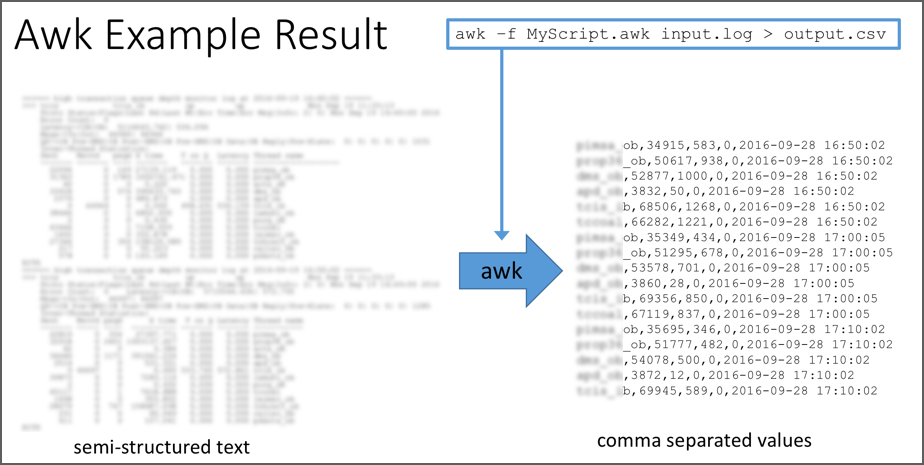

# AWK

The `awk` command is named after its creators:

* Alfred Aho
* Peter Weinberger
* Brian Kernighan

Awk is one step up from `sed`.
Whereas `sed` provids editing capabilities within the context of a
single line, `awk` is a full programming language capable of maintaining
state throughout its entire execution.
It's also simply enough to provide value as a single option on
the command line.

```
awk '{print $2}' names.txt
Hire
Campbell
Torres
Kravin
Kerkoff
Peterson
Wilson
Harman
Knight
```

The `awk` script itself is between the single quotes.
It prints the "second column" of the input, which is
the last name in the `names.txt` file.

Now let's step back and understand what's going on.
There are some similarities to `sed`.

1. There is an implicit read loop.
2. Each iteration of the loop applies the entire
   script to a line.
3. Each `awk` command has the form

`[address range] { code block }`

Like `sed`, if the address range is omitted, as in the example above,
the code block applies to all lines.  The example above showed that
the command even applied to the header line, which is probably not
what we wanted.  We can skip the first line with

```
awk 'NR>1 {print $2}' names.txt
```

The `NR>1` means *if the number or records (lines) is greater than one*.

### Fields

Awk has powerful builtin capabilities for processing tabular input data.
This makes it popular among system administrators for gleaning output from
other commands.  Here's a typical example.  The output from the AIX
`netstat` command has the following form.

```
netstat -na | head -6
Active Internet connections (including servers)
Proto Recv-Q Send-Q  Local Address          Foreign Address        (state)
tcp        0      0  *.*                    *.*                    CLOSED
tcp        0      0  *.*                    *.*                    CLOSED
tcp        0      0  *.*                    *.*                    CLOSED
tcp        0      0  *.*                    *.*                    CLOSED
```

A quick way to find listening ports is to grep on the `(state)` column
for `LISTEN`.
```
netstat -na | grep "LISTEN" | head -6
tcp4       0      0  *.13                   *.*                    LISTEN
tcp        0      0  *.21                   *.*                    LISTEN
tcp6       0      0  *.22                   *.*                    LISTEN
tcp4       0      0  *.22                   *.*                    LISTEN
tcp        0      0  *.23                   *.*                    LISTEN
tcp4       0      0  *.25                   *.*                    LISTEN
```

But `awk` allows us to focus on the column of interest.
```
netstat -na | awk '$6 == "LISTEN" { print $4 }' | head -6
*.13
*.21
*.22
*.22
*.23
*.25
```
We addressed each line by `$6 == "LISTEN"` and then printed only the
listening IP and port in column 4.

## Awk Scripts

The `awk` scripting style is easily recognizable when followed.
```
BEGIN {
   OFS=","
   # run BEFORE processing any lines
}

/some regex1/ {
   # what to do when we see regex1
}

/some regex1/ {
   # what to do when we see regex2
}

END {
   # run AFTER processing all lines
}
```

The following diagram shows AWK in action.
You can see how the text to the left is semi-structured.
This is output from an application monitor command.
The format is easy for humans to read; but importing this kind
of information into a spreadsheet could be difficult.
AWK is ideally suited for this type of transformation that combines
information across several lines of input into a single line of
CSV output.



Let's write script that demonstrates holding state across lines.
The script `loginSummary.awk` displays a summary of the logins from
`logins.txt`.  The input file begins as

```
Date       Time      Name
2017-02-01 08:01:32  Roger Campbell
2017-02-01 08:03:02  Lisa Torres
2017-02-01 08:12:45  Robert Kerkoff
2017-02-01 08:40:09  Karen Peterson
```
We can see it has a header that we should ignore.  
So our *address range* is `FNR>1`.  The `FNR` variable is built-in
to `awk`.  It represents the number of records (lines) read so far.
So when `FNR>1`, we're past the header line.  For the rest of the
input, the following field variables are available to us.

* `$1` - the date
* `$2` - the time
* `$3` - first name
* `$4` - last name

We assign a name to the `name` variable as "last, first".
We then use this string to create an entry within an associative
array named `login`.  Note that we didn't not have to initialize
the array itself nor the elements within it.  The `++` operator
increments the value.

```
FNR>1 {
  name = $4 ", " $3
  login[name]++
}

END {
  for (name in login)
    printf "%-20s %d\n", name, login[name]
}
```

The `END` block runs after all the lines have been read.
At this point, the `login` array contains an entry for
each encountered name.  We simply print the contents
using a `for` loop.

We can run this script using the following command.

```
$ awk -f loginSummary.awk logins.txt
Campbell, Roger      4
Harman, Sam          3
Peterson, Karen      3
Torres, Lisa         2
Kerkoff, Robert      3
Wilson, Sally        3
Kravin, Samuel       3
Knight, Peter        3
$
```

We can using piping for both input and output.  The following
example pipes the output to the sort command.

```
$ awk -f loginSummary.awk logins.txt | sort -k 3rn
Campbell, Roger      4
Harman, Sam          3
Kerkoff, Robert      3
Knight, Peter        3
Kravin, Samuel       3
Peterson, Karen      3
Wilson, Sally        3
Torres, Lisa         2
$
```
The option to the `sort` command is `-k` to tell `sort`
which key to use.  The value of the option is `3rn`
which means

* `3` - sort on the 3rd field
* `r` - reverse the order (highest to lowest)
* `n` - numeric (otherwise 20 < 5 since 2 < 5).


## References

* _GAWK: Effective AWK Programming_. 4th Ed.  Arnold Robbins.  This documents the
  GNU implementation of AWK (hence GAWK).  The PDF is freely downloadable.
  <https://www.gnu.org/software/gawk/manual/>.  GAWK has more features than
  plain AWK.  Make sure you know where your scripts will run before you
  dig too deeply into GAWK.

* _sed & awk_. 2nd Ed.  Dale Dougherty & Arnold Robbins.  This book is
  published by O'Reilly and quite popular.  While the explanations are
  great, my only issue is that many of the examples center around an
  antiquated text rendering program known as `troff`.  Granted, the
  byzantine syntax of `troff` provides an abundant source of examples
  to search and change odd text sequences.  But most people who entered
  the industry within the last 20 years have never heard of `troff` and
  will likely find them uninspiring.
