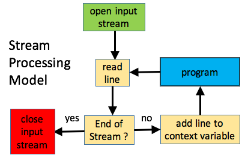

# Line Oriented Utilities

*Line oriented utilities* processes input as the name implies:
one line at a time.  While this is not optimal in terms of execution
speed, it's highly scalable in terms of file size.
Line oriented utilities can process files that are much larger than
the available memory since only one line at a time is required for
processing.

## Processing Model

A line oriented task has the following steps.

1. Read the next line from a source file.
2. Process the line
3. Repeat until end of source file.

Since steps 1 and 3 are inherent in the task, they are performed
automatically by the utility.  Step 2 is where the *scripting*
comes in.  In the figure below, the program we write is shaded
blue.  The other tasks are performed by the utility.



The term **program** in the shaded blue box is very general.
It can be anything from a script that is hundreds of lines long
to a short character string passed directly into the command.
The distinguishing characteristic among all line oriented utilities
is that user only has to address the line processing.


## Gnu Utilities

This section will introduce three line oriented utilities that are
common within operating system environments similar to Linux.
While often assumed to be *part of the operating system*, they
are actually produced by the [GNU](https://www.gnu.org/) organization.
[Binary downloads for Windows](http://gnuwin32.sourceforge.net/packages.html)
are also available.

It's helpful to classify these three utilities in terms of their
increasing range of edit context.

| Command  | Edit Context                                |
|----------|---------------------------------------------|
| **grep** | No editing                                  |
| **sed**  | State from current line                     |
| **awk**  | State from current line and previous lines  |

The `awk` command has more context, more power, and more complexity.
The `grep` command has the least context and is the simplest to use.

These utilities are covered in more detail within their own subsections.

* [grep](grep/readme.md)
* sed
* awk

Please review the following section on *shell globs* if you are not
familiar with how a shell parses a command before invoking a utility.

## Beware of the Shell

In many of the samples provided in the subsections listed below,
the search criteria is specified on the command line directly to the
utility.  In this case there is an intermediate step by which the
operating system shell parses the command.  Here are some tips to
make sure your commands are parsed properly.

### Quotes

Quotes are recommended for delimiting search expressions.
Consider the following example.
```
grep sam smith *.txt
```
We might assume this means search all files that end with `.txt`
for the string `sam smith`.  But the shell does not pass
`sam smith` as the search argument to `grep`.  It uses the space
between `sam` and `smith` as separator.  It treats `sam` as the
search expression and `smith` as the name of a file to search.
The command we really want is
```
grep "sam smith" *.txt
```
This tells the shell to pass `sam smith` as a single search expression.

If you run in the Windows command line, this is pretty much the end of the story.
Linux, however, supports double quotes and single quotes.  Notice the different
way double and single quotes render the following expressions.
```
> export myname=paul
> echo "Here is a variable $myname"
Here is a variable paul
> echo 'Here is a variable $myname'
Here is a variable $myname
```
In Linux shells, variable substitution occurs within double quotes, but not
single quotes.
Dollar signs are used in regular expressions where, conceivably, they could
be mistaken for variables.  This is actually very rare since the special meaning
of `$` in a regular expression means *last thing on the line*.  I've never seen
a regular expression with something following a `$` since it couldn't possibly
match.

However, the reverse confusion is possible.  We might have a shell script that
calls grep to search for a name in a variable.  Consider the following two ways
to invoke `grep`.
```
grep "$myname" names.txt
grep '$myname' names.txt
```
The first one evaluates `$myname` and passes the result to `grep`.  The second
one passes the string `$myname` to grep.

### Globs

**Globs** are similar (but different!) to regular expressions, but much simpler.
They are most commonly employed as *file globs* in order to match a set of files.
For example:
```
grep "sam smith" *.txt
```
The `*.txt` is a *file glob*.  The `*` character represents "*anything*".
(Not to be confused with the regular expression meaning of
"*any number of the things before*".)
When the shell receives the above command, it will
1. Search the current directory for all files that end with `.txt`
2. Replace the string `*.txt` with string containing each filenames
   found in step 1.
3. Pass this enhanced command line to the `grep` command.

The `grep` command never sees `*.txt`.  It only sees the list of filenames
that the shell replaced it with.
