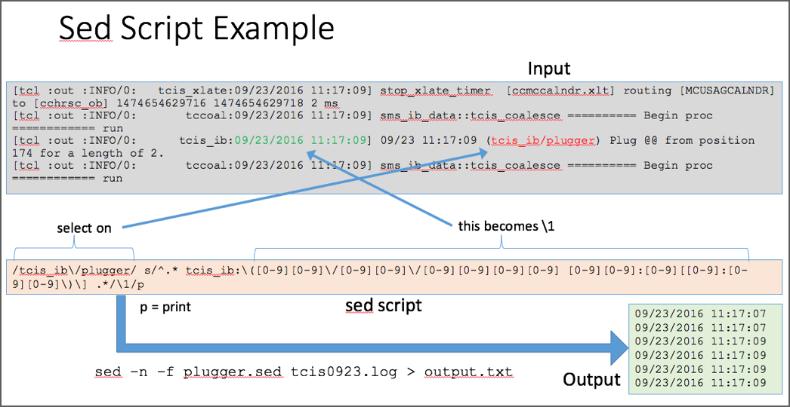

# Sed

The name **sed** is short for **s**tream **ed**itor.
It goes one step beyond **grep** in that it allows for editing
of matched lines.  Invocations of `sed` commonly differ in two
ways than `grep`.

1. The `sed` invocation references another file containing
   the `sed` editing commands (a **sed script**)
2. The output is saved to another file.

The `-f` option allows one to specify a sed script.  Since `sed`
sends its output to *stdout*, one uses I/O redirection to save
the output to another file.

## Commands

A `sed` command has the following form (square brackets mean "optional").

   [address range] function [modifier]

Here is an example.

```
$ sed "2,5 d" names.txt
Name           Hire Date  Experience
Karen Peterson 03/03/2015 16
Sally Wilson   05/19/2014 10
Sam Harman     01/20/2015 12
Peter Knight   02/07/2015  5
```

The **address range** is `2,5` which means lines 2 - 5.
The **function** is `d` which means **delete**.  So this invocation
of `sed` deleted lines 2 - 5 of the input and left the other lines
alone.

If no address range is specified for the command, the function of the
command applies to all lines of the input.
A `sed` script can have multiple commands.

### Suppress Default Printing `-n`

Input is processed by `sed` one line at a time.
The function to apply to the line is determined by the address ranges
that match it.  If a line does not match any address range,
the default function of `p` (print) is applied.  This means all
lines **not** specifically matched by the address ranges will
"flow through" to the output.  There are many cases where this is
not desirable; rather, we want to **suppress** any line that is not
explicitly matched.  To enact this default, invoke `sed` with the
`-n` flag.  Most of the examples in this tutorial will be invoked
this way.  The following example shows `sed` functioning like
`grep`.

```
$ grep "Sam" names.txt
Samuel Kravin  09/21/2015  8
Sam Harman     01/20/2015 12

$ sed -n "/Sam/p" names.txt
Samuel Kravin  09/21/2015  8
Sam Harman     01/20/2015 12
```

In this example, the **address range** is `/Sam/`, which means
"all lines with 'Sam' somewhere".  The function is `p` for print.
Because the `-n` suppress options was provided, non-matching lines
were deleted.

### Warning: Redirected File Replacement

Sed is effectively scripted editing.  Normally you edit a file
and save the changes back to the same file.  This is not possible
with `sed` unless you use an intermediate file.  One might be
tempted to try

```
sed -n -f MyScript.sed MyPrecious.txt > MyPrecious.txt
```

* This runs the `sed` commands in `MyScript.sed` against the file
  `MyPrecious.txt`.  
* The file `MyPrecious.txt` is reset to zero length.
* Its contents are filled with the output from `sed`.

The problem is that the first two items in this list **occur** in
the reverse order from how they are displayed.  The OS will prepare
`MyPrecious.txt` for writing by deleting its former contents.
By the time `sed` process it, the file is already empty.
This is usually remedied with a temporary file.

```
sed -n -f MyScript.sed MyPrecious.txt > tmp
mv -f tmp MyPrecious.txt
```

## Sed Functions

Sed acts on input one line at a time.  The buffer in which
the current line resides is called the **pattern space**.
When a line is loaded into the pattern space, each command
with an address range that includes that line has its associated
function applied.

When there are multiple `sed` commands applied, each command
receives the pattern space from the command applied before it.
Only the first applicable command is guaranteed to see the line
as it originally came from the input.

This presentation is only going to cover a few `sed` functions.

* `p` - print
* `d` - delete
* `s` - substitute

The first two are straight forward.  The `p` function simply
leaves the pattern space unchanged.  If other commands follow,
the pattern space will be presented unchanged to the next
commmand.
The `d` function deletes the entire pattern space.  Any
commands that follow will only see an empty pattern space.

The **substitute** command is the interesting one.  It
conditionally modifies the pattern space at locations identified
by a regular expression.

```
sed -n "s/Sam/Samuel/p" names.txt
Samueluel Kravin  09/21/2015  8
Samuel Harman     01/20/2015 12
```
The above command matched any line containing `Sam` and changed
it to `Samuel`.  Things to note:
* The `-n` flag suppresses default printing of lines.  The `p`
  modifier on the end overrides this.  So only matches are printed.
* The address range was omitted.  This applies to every line.
* We changed every occurrence of `Sam` to `Samuel`, even a `Sam`
  that was already the first part of `Samuel` (see first line
  of result).

Let's match occurrences of `Sam` that are not part of `Samuel`
by placing a space into the match.

```
sed -n "s/Sam /Samuel /p" names.txt
Samuel Harman     01/20/2015 12
```
By removing the `-n` and `p`, we get the version that
prints every line by default, changing lines that
contain `Sam `.
```
sed "s/Sam /Samuel /" names.txt
Name           Hire Date  Experience
Roger Campbell 02/05/2015 23
Lisa Torres    05/20/2014 12
Samuel Kravin  09/21/2015  8
Robert Kerkoff 11/14/2014  5
Karen Peterson 03/03/2015 16
Sally Wilson   05/19/2014 10
Samuel Harman     01/20/2015 12
Peter Knight   02/07/2015  5
```

Let's using our RegEx grouping skills to flip the order of
first and last name.  In `sed`, substitution groups are denoted
by `\N` where `N` is some number.  `\1` is the first, `\2` is
the second, etc.

```
sed -n -E "s/^([[:alpha:]]+) ([[:alpha:]]+)/\2, \1/p" names.txt
Campbell, Roger 02/05/2015 23
Torres, Lisa    05/20/2014 12
Kravin, Samuel  09/21/2015  8
Kerkoff, Robert 11/14/2014  5
Peterson, Karen 03/03/2015 16
Wilson, Sally   05/19/2014 10
Harman, Sam     01/20/2015 12
Knight, Peter   02/07/2015  5
```
Several things to note:
* The `-E` option denotes "modern regular expressions", so use a phrase
  from the `sed` manual.  So we don't have to escape the grouping
  `(` and `)` and the `+` quantifier is allowed.
* The `^` after the first slash means start at the very beginning of the line.
* `[[:alpha:]]` means any alphabetic character.  The `+` after it means any
  positive quantity.
* There are two groupings: one for the first name, one for the second.
  They are referenced in the replace segment in reverse order with a comma
  separator.

The "modern regular expression" version of `sed` is free.  But if you pay
enough money (sic), you can acquire a version of `sed` that only supports
basic regular expressions (AIX, Solaris, etc).  This is the equivalent
expression using BRE.
```
sed -n "s/^\([[:alpha:]][[:alpha:]]*\) \([[:alpha:]][[:alpha:]]*\)/\2, \1/p" names.txt
Campbell, Roger 02/05/2015 23
Torres, Lisa    05/20/2014 12
Kravin, Samuel  09/21/2015  8
Kerkoff, Robert 11/14/2014  5
Peterson, Karen 03/03/2015 16
Wilson, Sally   05/19/2014 10
Harman, Sam     01/20/2015 12
Knight, Peter   02/07/2015  5
```
Ugly things to note:
* A backslash was required for every grouping parenthesis.
* The `+` quantifier is not supported.  So in order to express the notion
  of "one or more of X", we need `XX*` which means "one X followed by
  zero or more of X".

## Sed Scripts

You may have noticed that with each `sed` example, the commands have been
getting longer.  This is a good segue for `sed` scripts - which are simply
text files with long or multiple `sed` commands.

The following graphic demonstrates `sed` in action.
The grey box contains the input.  We wish to extract the date-time text
in green; but only if it appears on a line with the text in red.  We don't
want the other lines.



The one-line `sed` script is in the peach box.  The address range selects
the lines we want, namely those containing `tcis_ib/plugger`.  The `sed`
function is `s`, substitution.  We use grouping to isolate the date time.
This is available as `\1` on the replacement.  The `p` on the end sends
the replacement to the output.

The `sed` invocation syntax is shown below the blue arrow.  We use the
`-f` option to specify the file containing the `sed` commands.  The
output is sent to `output.txt`.  The green box shows a sample of the
output text.  It's a series of date-time stamps that easily processed
by analysis tools.

## Benefits

This is all very nice.  But why use the regular expression
facilities within `sed`?  We've seen its regular expression support is
poor compared to other APIs we've seen.  And it is **not**
available by default on Windows platforms?

**Sed** still comes in handy in many situations.  While `sed` is not
popular on Windows, it **is** popular in server environments such as
Linux, AIX, HP-UX, and Solaris on which a great deal of server
infrastructure runs.
The sed script example above filtered a log file on an AIX machine.
We could have moved the log file to a Windows machine and filtered
it there using our favorite Windows tools.  But there are a few
obstacles.

1. The original log file is several hundred MB in size.  The file
   transport could be cumbersome, especially if there are many such files.
   By running the `sed` script on AIX, only the filtered file is transferred.
   It is a tiny fraction of the size of the original file.
2. The original log file contains sensitive information that
   must be protected.  The filtered file is nothing but a set of timestamps.

When these factors are present, they make a compelling case for tools
like `sed`.
